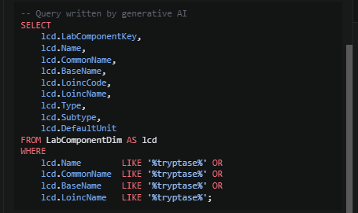
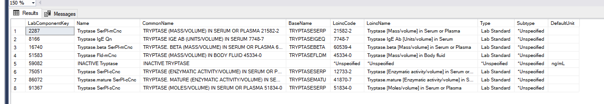

# HaT PheWAS: Considerations For Later

Ideas and checks for `YAMLs/temp/hat_phewas_intake.yaml` and the analysis after it.

## Tryptase Labs

Done (2026-10-02): `hat_Labs` is in the intake. It has every `LabComponentResultFact` column, plus every `LabComponentDim` column through a LEFT JOIN (40 columns). It is filtered to the eight tryptase LabComponentKeys found on the VM with the query below.

All eight are kept; cull in Python:

- **2287 Tryptase SerPl-mCnc** (LOINC 21582-2) is the usual baseline serum tryptase, and probably most of the rows.
- **8166 Tryptase IgE Qn** (7748-7) is an IgE antibody to tryptase, not a tryptase level. Drop it before using values.
- **59082 INACTIVE Tryptase** is a retired component (no LOINC); older results may sit under it.
- **51583** is body fluid, not serum; **75051, 86072** are enzymatic activity and **91367** moles/volume, so their units differ from ng/mL. Check `Unit` before comparing values.

With it:

- validate the D89.44 cases (how many have a tryptase on record, and how high: baseline above about 8 ng/mL);
- later, exclude controls with an elevated tryptase (the ctrl\_ pull needs the same table);
- `Value` is text and `NumericValue` a float; results like "<1.0" have no NumericValue but may have `StructuredBoundaryOperator_X` and `NumericBoundaryValue_X`.

## Department Names

Done (2026-10-02): `DepartmentDim` is in the data dictionary and `hat_Encounters` LEFT JOINs it, so each encounter has `DepartmentSpecialty`. Still open:

- DepartmentDim has no department name column a pull can read; specialty is the finest grouping. (`ServiceAreaEpicId` is SlicerDicer only.)
- `DepartmentKey` values below 0 are structural placeholders, not real departments; drop them before counting by specialty.
- `SiteFullyUsableInCosmosStartDateKey_X` / `EndDateKey_X` say when a site's data is complete. They could restrict observation time to complete sites.
- To see who *diagnoses* HaT, join `hat_Patients.IndexEncounterKey` to `hat_Encounters.EncounterKey` for the index encounter's specialty.

## Checks After The Pull

- **Index dates before the code existed.** D89.44 entered ICD-10-CM on 2021-10-01 (FY2022 code set; worth confirming). Count `hat_Patients` rows with `IndexDate < 20211001`. `IndexDate` is each patient's first D89.44, so any patient counted there has a diagnosis record that was mapped to D89.44 after the fact (DiagnosisTerminologyDim maps a diagnosis record to its current code, whatever the event date).
- **Coding before D89.44.** Patients diagnosed before 2021-10 were likely coded D89.49 or another D89.4x. Look for D89.4x in `hat_Diagnoses` before each index date.
- **Diagnosis coverage vs observation time.** Encounters may appear in years where ICD codes do not. Start observation no earlier than the first year with diagnosis rows, or controls and cases get time-at-risk in which no diagnosis could appear.
- **Ruled-out D89.44.** `hat_Patients` takes a D89.44 of any Type or Status. Rebuild the case set and index date from `hat_Diagnoses` after filtering on `DiagnosisStatus`.
- **Cosmos vs SneakPeek.** The pull is `Dual` on purpose: SneakPeek (a 1% set with the same columns) runs first and shows the pull works on the smaller set. The analysis uses the Cosmos tables; the `_sp` tables can be ignored after that.

## Culling In Python

The pull takes more than the analysis needs: every column, and rows the analysis will drop. In one place, what to cull:

**Tables**

- The `_sp` (SneakPeek) tables, once they have shown the pull works.

**Columns that cannot vary** (the pull filters on them, so each holds one value):

- `IndexIsDeleted`, `IndexDxIsDeleted`, `PatientIsDeleted`, `IsDeleted` (Encounters, Diagnoses, Labs), `TerminologyIsDeleted`: always 0.
- `IndexICDCode` (always D89.44), `IndexICDType` and Diagnoses' `Vocabulary` (always ICD-10-CM).
- `IsCurrent`, `IsValid`, `UseInCosmosAnalytics_X` (hat_Patients, from PatientDim): always 1.

**Columns of little use to a PheWAS** (look once, then drop): the `…DisplayString` and `…WeeksDisplayString`-style duration strings, `SourceComboKey`s, `Count`, the `Svi…2018_X` columns where the 2020 ones are present, `LastImmunizationQueryInstantUtc`, `BloodType_X` and the Rhesus columns.

**Rows**

- **hat_Patients:** not culled itself; the case set is rebuilt from hat_Diagnoses (next line) and the PK kept as the control exclusion list.
- **hat_Diagnoses:** ruled-out (and any other non-diagnosis) `DiagnosisStatus`; then collapse to one row per patient, code and date; drop D89.44 (and decide on the rest of D89.4x) after counting its dates for the case rule.
- **hat_Encounters:** cancelled or no-show `DerivedEncounterStatus` for visit counts; `DepartmentKey < 0` before grouping by specialty; `DepartmentIsDeleted = 1` if any.
- **hat_Labs:** component 8166 (IgE antibody, not a level); results with `IsBlankOrUnsuccessfulAttempt = 1`; non-ng/mL `Unit`s (51583 body fluid, 75051 and 86072 enzymatic activity, 91367 moles/volume) unless converted; then decide on 59082 (inactive) by looking at its units and dates.
- **Every table:** rows outside the analysis window, once Python sets it (the pull starts at 2015-01-01).