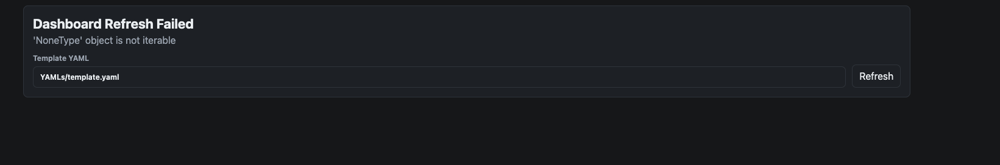

# Current Fixes

- when I hit 'new blank template' - it should actually make a new blank template. It should show on top, where 'tamplate yaml' is, a \_temp.yaml, and name the new one that. Once I give it a Project Folder it should then update teh file name to (project_folder)\_temp.yaml
- in CosmosDB, 'dual' should be the standard, not COSMOS.
- 'small set' seems to be on by default. Turn this off by default. (Is there a place I can edit these defaults? )
- So I think I have to fundamentally rethink how the batches work. The intent is that when I have a very large set of things to download, that I want to instead have the set downloaded in smaller batches so that I can have a whole PK table of let's say one million patients, and then it starts pulling the fact tables in batches of whatever. But you just told me that right now my batch system goes through and redoes a batch every single time, comma, for a state, for instance. So if I have a million patients and they're split by fifty states, that it has to go through and find everyone in the state of California, then do the run, then find everyone in the state of Arizona, and then do the run. So it's doing fifty versions of a miniature PK t table.
  - This very much defeats the purpose of doing the batching because it is actually fifty times as long instead of the same length in 50 pieces.
  - The only way I can think to change this is to make a batch such that it downloads all of the PK t table that fits within the parameters down into projects entirely. And then we essentially treat it like an upload batch output system where we do our traditional upload cohort from a DB table, but we then do our batching there and split it up into however many cohorts we would need. I imagine this doesn't mean that I have to make fifty parquets But perhaps 50 new temp tables within projects. That way I can just iterate on the temp tables and run them through. Either way, it doesn't really seem like this current system is working, but if we get the whole PK table into projects and then treat the rest of it like we are pulling from that, then hopefully we can just do all of the pulling once and then iterate through each batch.
- More I think about it, The more I think it would be useful to have a python .venv of the DSVM's plugins. Essentially an isolated version that mimics the DSVM with the older versions of whatever the necessary plug-in is. I don't need to install all the plugins because it seems like a very huge list, but we could have a rule that if this computer needs to test a feature with a certain plugin, that it goes through and finds if it's in the DSVM plugin list and then installs that specific version. That way we don't have to get me permission, but also we are sure that it's a good test environment.
- I don't know if we need the 'YAML' tab in teh YAML manager. It seems like we may not even need the 'exports' tab now that we have it in the Builder.
- For some reason, the \_sp builds in the cohorts tab don't seem to have the same system of adding dependencies. Did I remove this when you asked about PatientDurableKey excess? I thought that was for a diffefrent thing. Instead, I would like this same color coded relation system to still show on teh \_sp versions of the examples. \
  Image:\
  {width="498"}
- I don't specifically understand what the retry failed toggle is doing in the pull manager.
- I think I understand that re pull everything basically ignores the idea that a pull was done and I think that's a good idea. I also really like that the done system seems to work just fine.
- had a chance to make the artifacts just yet because I've been fixing all these smaller bugs. As soon as these cohorts finish, I will try it on all three of them. Do I just click the artifacts button? Does it just do it based on what's in the split folders?
  - I actually completed one run and hit 'artifacts', and it gave no update and just said 'finished' at the end. I think it needs to give more info. Specifically what files were created, what parquets are being created and whenever they are, how many rows, how long it took, any errors.
- when a new \_temp yaml is made, I want it to go into the folder YAMLS/temp on this mac side.
-  I think now is the time to think about bundling the YAMLs with the make bundle.py. I believe we have it through CLI commands, but let's think about the YAML manager UI. We currently have a save and refresh button on the right side, which I think is great. I think that when I do a save and refresh of a YAML that it should automatically be added into a queue of YAMLs to be bundled with export. It should just check that it's been added and it shouldn't add it multiple times. I think the list of current ones should be on the 'export' button on the 'Builder' tab. It should be a list of what's currently loaded, with a 'remove' option next to each. Clicking on it shows teh 3 versions (pre-YAML, Transfer Yaml, pullmanifest.yaml) for that specific \_temp.yaml. I think the system should look through the newly made YAMLs/temp for what's there, and allow me to add one from a dropdown menu, only showing the ones not already loaded. This way I can re-do an old one as well when a client wants a refresh.
- The transfer YAML text in Exports should say Transfer YAML (to be bundled with bundle.py). I still want those to dump out to root of folder over on the VM side.
- in Builder tab, cohorts, I want a number option next to up and down, so I can give the place for that specific column in the order of the columns. In fact, we can get rid of 'up' and 'down' and simply have an order number. when I change the number, refresh when I hit 'enter' so it magically moves to that spot in the order. For inscance, whatever is teh last column, if I make it '1', then it should go to the first (i.e. the top of the list).
- Right now the waidth of the yaml manager seems to top out, scrunching much of the material in it. I want it to widen tothe width of the monitor so that I can truly utilize the space and things can be
  - example: 
  - 
- I went to make a change, and then hit 'save and refresh'. Instead of explaining where the error was, I got 'NoneType' Object is not iterable'. I can't have it fully go to this 'refresh failed' page and then lose my place in the system, I need to be able to get where the error is, (by naming it or highlighting the location) and then iterate and hit the save & refresh again and see if it worked. Now, i've made 20 changes and don't know which one is the error.
  - reference image: 
- In the 'uploads' tab, 'parquet' shouuld be the standard option.
- If I choose a CSV in the upload, there should be a 'add to bundle' option. If I select that, then when I give it a file_loc then it should look for that file as part of the validation and warn if it can't find it. Once it finds it, then that should be added as part of the bundling so that it becomes added to the transfer.
- when I hit 'save & refresh, it shoudl remember what tab and section I was on so it keeps me there.
- Transfer Yaml is

# Commemorating

For one instance of Claude to do, separate from the other headings.

- I made a folder in QMDs related to getting the history of this project. Look at the last day that that was edited/committed in teh git. Many changes were made since then, and I want them to be documented in 'thoroughhitory.qmd'. If you can isolate the changes by date great, if not then just compare decisions, design, roadmap MDs against that document and add what's missing.

# UI Redesign ideas

## tkinter-based UI for yamlmanager

- I really like the interface of the tkinter plugin. It's able to use the file explorer to find files, it can take text, it can do buttons. I'd like to explore if I could do the entirety of the yamlmanager in this, as well. If not, that's fine. We should have the UI/UX decoupled from the engine anyways, so I want to see if we can just make a fully usable tkinter system. We can't add any imports unless it's literall something we can copy into a text file and not run an installation on, so hopefully all this can be reproduced with just tkinter's native options. I want you to start with just taking the current logic of the web UI and translating it to tkinter.

## Separate idea - 

- I'm going to imagine the variables in a UX-friendly readable interface. It can map to the variables we already have, so we dont' have to worry about redoing core logic. Don't make it yet - I want you to ask me any questions you ahve about function, and tell me how doable all this is, in both the web UI on mac and also tkinter on both sides.

  - Project name at top -

    - Dropdown if possible, if not then just text and 'browse'. a 'new' button next to 'browse', which makes 'new_project_intake.yaml'. (new_project is the project name, intake is the phase of the yaml. I'm either intaking from a client by phone or via a chatbot that i design to ask and elicit the quetsions. It's better than 'temp' currently.)

    - "pull from:" text with toggles for "Cosmos" and "Cosmos_SneakPeek", both turned on by default. If both are on, system reads it as 'dual'.

    - Project DB: Prefill PROJECTD33A929, but can be edited.

    - Study Variables section:

      - Min Start Date, Max Start Date. SHould default to 19900101,  20260601. Note that it's in YYYYMMDD format.

      - "Collect all patients matching criteria:" Toggle as well, true on default. If checked, 'smallset = false', and greyed out options for sample size (field) and 'random sample' (toggle). If unchecked, fillable fields.

    - Builder section: Basically what we have for builder, but split a little differently:

      - Primary Key (PK)

        - should give options for recipes, a new table from the dictionary, or a parquet, csv or current Projects.dbo.table (called 'dbtable'). If parquet, or CSV, require a 'browse' or input directory. If dbtable, can just be a text input. parquet, csv and dbtable will likely be empty - I'll be making these on the Mac side and can't access the VM's files. If that's the case, it has to provide a warning that doesn't prevent compiling of the \_transfer yaml.

      - Supporting Tables (formerly upload)

        - CSVs, parquets, where you name them. It should be able to see the categories, and you should be able to edit the end-column names.

        - remove the 'pk table' option here, but otherwise have it be the same

      - Multipliers and Splitters

        - "Multipliers" section: With explanation saying that each level will be its own cohort, which is during_build as of now.

        - "Splitters" section (formerly batching, and also formerly split_after_build): with explanation that it will split the PK table by a specific column in the PK, or chunk by number of rows.

          - Will have chunk: option with input field

          - will pull the pktable's columns, in dropdown menu. Button to add, without input field. Once added, will then show input field which does the x-able system we have now.

          - If the PKTable hasn't been input yet,

      -