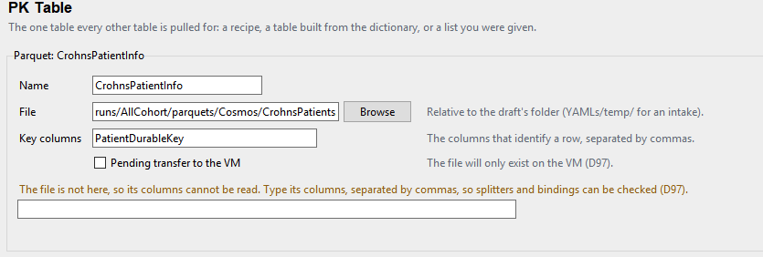
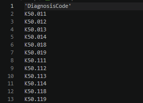
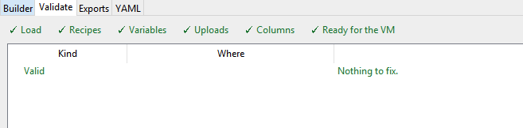
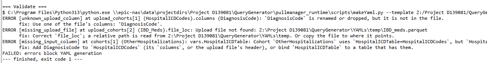

## New UI

It looks and runs substantially better. Going through the whole order and will give by section

Builder:

- the popup for 'new table from the dictionary' is a good idea, but we can make it simpler. In 'add a fact table' right now you have "prefabricated" with a dropdown, next to it let's do 'from data dictionary' and have that show the 'rows from' dropdown. the Name space to the right should also have Name like the others. When anything is selected from a dropdown menu, it should expand and have all the editable things of a new fact table (name, destionation, description, granularity, etc.) Make this 'add a fact table' at the top, maybe visually separate with a subtle color change or shadow compared to the other fact tables, so it's clear that it's the addition space.

- I love that 'Otherhospitalizations' showwed 'needs DiagnosisCode. UX works well for this. I want to have a same limited set of codes for medications, and I am uploading a CSV of medication codes. In general I'd like to have some sort of space for adding filters ( i think we had that back in web UI). It would be slightly different for the "JOIN" and "where" sections. It looks like these were not moved over during the transition to tkinter UI. \
  \
  There should be blank spaces (single input field for an addition) and option to add multiple. They should be able to show the columns of the table in a dropdown, and have somethign like 'by column: ' in front.

  - For JOIN, it should basically do what teh web UI's system was, including offering join type with an explanation and the join method (= or \<\>).

  - for 'where', it should have that column and then a dropdown of options. Standard is 'value', and gives an input field nedt to it. But another should be "included in supporting table value", and tehn it pulls up the same dialogue that is present in Other Hospitalizations - it gives a dropdown of supporting tables, and dropdown of the volumn after that. Again, this won't be very usable on mac side but on VM side I should then be able to link those.

- Where the 'bundled yamls' section exists, have a button that says 'make bundle', and which deletes the current bundle in dist, and writes a new bundle.py. The success display text should give the content_ID, and stay on there. also in it have a small content_id.txt within the /dist folder.

  - It looks like it didn't actually copy over the yaml. I copied it manually for now so don't worry but it should bundle all yamls and have them extract to the root. It's also possible that I missed some button I was supposed to press.

  VM SIDE THOUGHTS

- I

  PK Table:

- I don't understand what Key Columns is here for - i.

- Also, 'pending transfer to the vm' should not be an option here, because we are on the VM side. I think this means we should do a check in teh beginning to see if this is VM-side. I dont' want to but this checkmark is confusing. We probably can't check core things like IP or any other thing that might set off security systems, so maybe you can suggest to me what way I can do this by just looking at VSCodium info?

- image for reference: 

- But overall this is a significant improvement in usability. I'd say YAML management is now 80% of the needed features/UX experience. very well done.

VM side errors:

- Validation isnt working as expected. Diagnosis Code is being asked in teh yaml validation section, and it validates well but

  - CSV: 

  - builder: 

  - validation: 

  - Error: 

  - This is currently stopping progress. I will do 'browse' and find the files, and it doesn't seem to be able to find it, it's instead looking for it relative to the folder.

Other thoughts:

- Currently I'm in dark mode on Mac. So that means it's importing some sort of system setting - and it works fine. On older windows I wonder if there's even an automatic option. If not, it's not worth the hassle at the moment, so it should be in a 'future nice-to-have' sort of section in roadmap.

-