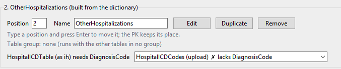

File for discussing ideas/improvements. Your notes, then Claude's reply in a box with a blue border, and yours in one with an orange border; type anywhere inside the orange box, between its `:::` lines (D174). New notes go above **Settled**; what is agreed moves there, then into the plan documents. Pasted images land in `images/` beside this file; `python3 scope.py images` deletes one once nothing mentions it (D132).

# Tasks

Nothing open here. What is left to see on the VM (the show-stopper tests' step 4 and clean-up, HaT PheWAS's checks, the Infant_RSV and UC re-pulls, the columns check) is in `status.md`, **To Check On The VM**.

# Explorations

## Returning to SP first

\
To that end, funny enough the system isn't actually running all the sneakpeek runs first anymore. I think it's because the logic thinks i'm batching by table so do 'patients_sp' then 'patients' then 'diagnosis_sp' then diagnosis'... But no that defeats the purpose. For any future run it should always do all the SPs first for the purpose of testing then go forth and do the regulars.

::: {style="border:2px solid #4a90e2; border-radius:6px; padding:8px 12px; margin:8px 0;"}
**🟦 Claude: agreed, and the code already does it; I need to see where it didn't**

**What the code does today.**

- **The split puts every SneakPeek session first** (D65): makeYaml sorts the sessions SneakPeek first, then cases before controls.
- **Execute runs the sessions in the manifest's order.**
- **A session runs all its tables before the next starts.** Batches and table groups (D190) are inside a session, never across two.

So the order is `ctrl_Patients_sp` (PK, Encounters, Diagnoses, Labs), then `ctrl_Patients` (the same). Patients_sp, Patients, Diagnoses_sp, Diagnoses never happens.

**Your two runs agree.**

- **The control pull's Status above:** `ctrl_Patients_sp` is done (its run took 12m 58s) before `ctrl_Patients` began.
- **HaT PheWAS (2 October):** SneakPeek's whole run finished at 18:28, and the Cosmos PK started at 18:28.

**Where it might have looked otherwise:**

- **A manifest split before D65** keeps its old order, Cosmos first. D65 applies from the next split.
- **Retry failed** pulls a failed Cosmos session without re-running a SneakPeek one that is done. That is correct, but it looks like Cosmos first.
- **The Pull Log of a session on its own**, from Re-pull sessions (D158).

**For you to decide:** nothing to change unless one of those doesn't explain it. Which pull, and where did you see the order (Pull Log, Status, the console)? A screenshot of the lines would settle it.
:::

::: {style="border:2px solid #e2904a; border-radius:6px; padding:8px 12px; margin:8px 0;"}
**🟧 Your response:**
:::

## Does the PheWAS need every encounter and every diagnosis?

(in the chat, 5 Oct, with the barebones control pull running) For the sake of argument: does the PheWAS really need *every* encounter or *every* diagnosis? What about collecting only encounters within x years of the index date they're tied to, and only the first instance of each diagnosis (deduplication)?

::: {style="border:2px solid #4a90e2; border-radius:6px; padding:8px 12px; margin:8px 0;"}
**🟦 Claude: no to first-instance diagnoses; yes to windows, and to encounters as a few summary rows. The biggest saving is pulling diagnoses for the matched controls only**

**What the analysis reads** (pheauxWAS design.md and decisions):

- **Diagnoses.** A patient counts as a phecode case only if the code is on **2 or more distinct dates**, inside the window. The primary window is the 3 years before index; the sensitivity window is everything after (D12). Ruled-out diagnoses are dropped in Python before dates are counted (D17).
- **Encounters.** Encounters only feed patient-level numbers. Those are the first and last completed encounter (`YearsBeforeIndex`, `YearsAfterIndex`), and clinic-visit days, ED visits and admissions within 365 days of index. No analysis reads an encounter row itself.
- **Every control's index is known at pull time.** It's the sampled clinic visit in `ctrl_Patients`, so a window relative to index can go in the SQL. D191 forbade date windows as a way to split a pull. A window that's part of what the study measures is a different thing.

**Diagnoses: first instance only would break the case rule.** The first instance alone can't tell 1 date from 2, and it's taken before ruled-out rows are dropped. What's safe:

1.  **A window:** `DiagnosisDate >= IndexDate - 30000` (index minus 3 years, as YYYYMMDD) plus a few months' margin. Python applies the exact window, as now. This drops the decades of older history that no window reads. The cost: the `all` window is gone, and a longer lookback later means pulling again.
2.  **Fewer rows per date (optional):** drop ruled-out rows in the SQL, then dedup to one row per patient, code and date. That's the same result Python computes from D17's rows. Only worth it if diagnoses are still large after the window.

**Encounters: three small tables instead of every row.** Each works with what Telescope does today (dedup and where lines):

- **First encounter:** completed encounters, deduplicated by `PatientDurableKey`, keeping the earliest `DateKey`. One row per patient.
- **Last encounter:** the same, keeping the latest.
- **Encounters around index:** completed Office Visit, Follow-Up, ED and admission encounters with `DateKey` within about a year of `IndexDate` (±10000 as YYYYMMDD, slightly wide). Python counts the exact 365 days.

Each still reads the whole date range in Cosmos, since a filter relative to each patient's index can't skip partitions. The saving is in rows landed, and at 300,000 patients that's most of the cost.

**Bigger than both: diagnoses and labs for the matched only.** D16 had this, and D30 dropped it because Telescope couldn't sample controls inside Cosmos. It doesn't need to:

- **Stage 1:** `ctrl_Patients` plus the three encounter tables, for the 300,000-patient pool. Then MatchIt.
- **Stage 2:** upload the matched keys, about 30,000 at 5×, as the PK (an uploaded PK works today). Pull diagnoses and labs for those patients only.

That's about a tenth of the diagnosis rows, before any window, and it doesn't touch how anything is analysed. The cost is two pulls and a match in between.

**For you to decide:**

- Whether to propose these to pheauxWAS as decisions there. Its D12, D16/D30 and D23 change.
- Which ones to take:
  - Stage 2 alone is the largest saving, and it changes no analysis.
  - The window drops the `all` option.
  - The encounter summaries change `build_group_parquet.py`'s inputs.

None of this needs a Telescope change. A `GROUP BY` table (one row per patient with counts) would be cleaner than three encounter tables, but it's a new feature.
:::

::: {style="border:2px solid #e2904a; border-radius:6px; padding:8px 12px; margin:8px 0;"}
**🟧 Your response:**
:::

## A code library in YAML: `reference/codes/ICDs.yaml`

(in the chat, 6 Oct) Moved the GI conditions to `reference/codes/ICDs.yaml`, per the Code Finder idea. I like it as YAML more than as parquet: YAML for people to read, maybe a YAML-to-parquet step after each update, since I won't add to a parquet by hand. Or keep it YAML from the start and have `scope.py` copy it over. Grouped by specialty (GI, Cardiology, Allergy...) and then disease type (Upper GI, pancreatic, autoimmune, heart failure...), so I can add sections as I go, as if recreating the ICDs for the GI multiplier.

::: {style="border:2px solid #4a90e2; border-radius:6px; padding:8px 12px; margin:8px 0;"}
**🟦 Claude: keep YAML as the only source; pick conditions from it in Author, which writes them into the template; make a parquet only when something reads one**

**Done in the chat.** `ICDs.yaml` is now `specialties > GI > <disease type> > <condition>`. The disease types are UpperGI, GIBleeding, FunctionalBowel, Diverticular, AutoimmuneInflammatory, Colorectal, Pancreatic, Biliary, Liver, CirrhosisComplications and ViralHepatitis. Each condition has `name`, `icd9`, `icd10` and an optional `note`. A condition's key (`GERD`, `PepticUlcer`) is its multiplier level name, so its tables come out as `GERDPtsWithDx`.

There are 47 conditions. The 28 in `GI_Conditions_intake.yaml` match it code for code. The rest are the items that intake left out (screening, history, cirrhosis complications, EPI, hepatitis C...), kept under their own disease types.

**What the code does today.** Nothing reads `reference/codes/`. It is not in `datascope.json`, and no bundle carries it. The intake's 28 levels were written by hand. The roadmap's Code Finder plans a parquet per vocabulary, with categories, read later as a supporting table (In supporting table, D119).

**Ways a pull could use the library:**

1.  **Picked in Author, written into the template.** Under Multipliers: "From the code library", where you tick a specialty, disease types or single conditions. It writes one level per condition, with `ICD_Value` set to its codes, as the GI intake has now. The template and blueprint show every code (D45). Nothing new travels to the VM, and editing the library later never changes a pull already written.
2.  **Named in the template, expanded at Validate** (`codes: GI/Pancreatic`). The template is shorter, but editing the library silently changes the next export of an old intake. I'd not do this.
3.  **A parquet made from the YAML** (`scope.py codes`, pyarrow on both machines), one row per code: Vocabulary, Code, Condition, DiseaseType, Specialty, Name. It is only needed once a table reads codes from a supporting table rather than from a level's `ICD_Value`, or once the Code Finder exists. Generate it then, never by hand. The YAML stays the source.

**Recommendation:** 1 now, with: - a `codes` entry in `datascope.json` (D111); - a check of the library on load. Condition keys must be unique across all specialties, since they become table names. ICD-10 codes must start with a letter, and ICD-9 codes must be digits, V or E. A clash is a loud error naming both places.

3 waits for the Code Finder.

**For you to decide:**

- 1, 2 or 3 (or 1 now and 3 later).
- Should condition keys be unique across the whole library (as now), or only within a specialty, with the specialty added to the table name when two specialties clash?
- Should other vocabularies (SNOMED, CPT, LOINC) get their own files beside `ICDs.yaml`, as the Code Finder's one-parquet-per-vocabulary has it?

**Suggested order**

1.  The library check and the `datascope.json` entry: small, and they stop a bad edit before any pull reads the file.
2.  "From the code library" in Author's Multipliers: what makes the YAML pay off.
3.  The parquet, with the Code Finder: nothing reads one yet.
:::

::: {style="border:2px solid #e2904a; border-radius:6px; padding:8px 12px; margin:8px 0;"}
**🟧 Your response:**
:::

## Pull and clear \_sp files when batch done

(from `tasklist-temp.md`) When the \_sp of a project is done, archive them to parquets and then clear the drive space. It should also be happening for each table as discussed before. It does not seem to be happening. Confirm current status of that feature.

::: {style="border:2px solid #4a90e2; border-radius:6px; padding:8px 12px; margin:8px 0;"}
**🟦 Claude: not built yet; D177 is the feature, and it covers SneakPeek's tables too**

**What the code does today.** A pull packages only once, at the end of a clean Execute (D141), and then drops its tables (D165). Nothing packages or empties a table mid-pull. A pull that fails, as GI_Conditions did, packages nothing and drops nothing, so SneakPeek's finished tables stay in the database while Cosmos runs out of room beside them.

**What was agreed and isn't built:** D177, packaging each table group as it finishes, then emptying its tables. With D190 every ungrouped table is its own group, so that is each table, SneakPeek's included: under `Dual` SneakPeek's sessions run first, so their tables would be parquets and gone before Cosmos starts. It is in the roadmap's Fixes, In Order, after the Status colours (D198, D204), alone in its bundle because it empties tables of real data.

**Until then, by hand**, on a pull that has stopped: Artifacts packages every finished table (it refuses while the pull executes), then clear_projects_db drops them; Artifacts by hand drops nothing itself (D165). Check the parquets before dropping. Then Retry failed.

**For you to decide:** nothing new; D177 is already agreed. Whether to move it ahead of the Status colours, since it is what frees the room.
:::

::: {style="border:2px solid #e2904a; border-radius:6px; padding:8px 12px; margin:8px 0;"}
**🟧 Your response:**
:::

## Size issue with GI_Conditions

(from `tasklist-temp.md`) I ran GI Conditions and it seemed to go fine with all the SP ones. Then it stopped at the first Cosmos run. It says that all the \_sp tables total were about 1.2 GB and the database had 15 GB. Yet when doing just the PKs and index diagnoses for that first GI condition it told me it ran out of space. It seems improbable. I'm re-running, but see if there's a reason this could be happening.

::: {style="border:2px solid #4a90e2; border-radius:6px; padding:8px 12px; margin:8px 0;"}
**🟦 Claude: not improbable; Cosmos is about a hundred times SneakPeek, and a landing needs its room more than once while it lands**

**Why it can be.**

- **SneakPeek is about 1% of Cosmos** (HaT: 49 patients against 5,969). So 1.2 GB of SneakPeek tables means roughly 100 GB or more for the same tables in Cosmos, over all 28 diseases. The first Cosmos session is GERD, among the commonest of them, so its PK alone may be several GB, maybe more than 15.
- **The window is wide.** `min_date_key` is 19900101, so the PK and IndexDiagnosis read every GERD diagnosis since 1990.
- **A landing holds its rows twice, and logs them once.** Each table first lands in a staging table, `#Local_<dest>`, in the Projects server's tempdb, outside any transaction. Then one `INSERT` copies it into the destination, in a single transaction (`local_sql.py`, `render_transfer`). So while it runs, the rows sit in tempdb and in the data file, and the whole insert sits in the log, which stops at 20,000 MB separately and can't reuse space until the transaction ends. A 9 GB PK can fail with 15 GB free in the data file.
- **The PK can't be chunked.** `chunk` splits runs, not the PK phase, so the PK always lands whole.

**What would settle which one.**

1.  **The error's text** (Status, double-click the failed row). `1105` naming the project database means the data file. `9002` means a log, and it names which: the project database's log, or `tempdb`'s. A tempdb error is the staging table.
2.  **GERD's SneakPeek size.** Rows and MB of `GERDPtsWithDx_sp` and `GERDIndexDiagnosis_sp`, from clear_projects_db or Status. Times about 120 gives what Cosmos needed.

**Before the re-run reaches GERD again** (it will fail the same way):

- **Narrow the window**, if the study allows (2015 on, as other pulls use). This is the biggest lever and safe for accuracy: the window is the study's definition, not a split (D191).
- **Fewer PK columns.** `ICDName` (NVARCHAR 850) and five race columns are wide; the PK needs the key, the index date and what the study reads.
- **Free the room first**: Artifacts, then drop SneakPeek's tables (the topic above).

**For the code, later:** the size estimate (roadmap) would have warned at stage 2, after SneakPeek, before GERD started. And a PK landed in chunks, or landed without the full staging copy, would need room for one piece at a time; that is new work, and I'd decide it after seeing the error.

**For you to decide:** the window and PK columns for the re-run. And send the error text and GERD's `_sp` sizes, so we know which limit it hit.
:::

::: {style="border:2px solid #e2904a; border-radius:6px; padding:8px 12px; margin:8px 0;"}
**🟧 Your response:** (in the chat, 7 Oct) The error is lost. Restarting GI_Conditions from 2015 (11 years is plenty) as a smaller pull, and retrying. Nothing for Claude to do.

Then found it, in the manifest: `GERDPtsWithDx/pk/GERDPtsWithDx: batch 1/1 failed: ... The transaction log for database 'ProjectD52219B' is full due to 'ACTIVE_TRANSACTION' and the holdup lsn is (884:224898:1). (9002)`, finished 6 Oct 20:48.
:::

::: {style="border:2px solid #4a90e2; border-radius:6px; padding:8px 12px; margin:8px 0;"}
**🟦 Claude: the project database's log, not its data file; and possibly an old open transaction**

**What 9002 says.** The data file had room. The **log** of ProjectD52219B was full, during GERD's PK landing, and it couldn't reuse its space because a transaction was still open. There are two ways that happens, and both may have played a part:

- **GERD's own insert.** The PK lands in one `INSERT` transaction (design.md, Space In The Projects Database), and the log holds all of it until it commits. A PK of several GB needs that much log, up to the log's 20,000 MB cap.
- **An open transaction left from before.** On 4 October, clear_projects_db showed this same database's log "waiting on an open transaction" (5,719 of 12,100 MB used). If that transaction was never ended, the log has kept every change since then. Each pull then starts with less log room, until a large insert fills it.

**Before GERD comes round again:** in clear_projects_db on ProjectD52219B, look at the log's line. If it says it's waiting on an open transaction, press **Open transactions**, end the one it names (or close the SSMS tab that holds it), then **Free log**. The 2015 window makes GERD's PK smaller, which helps either way.

**For the code, later:** a PK landed in pieces, each its own transaction, would need log room for one piece only. That's the same idea as packaging by chunk, for the PK phase. I'd decide it with the size estimate.

**For you to decide:** nothing now; check the open transaction before the retry reaches GERD.
:::

::: {style="border:2px solid #e2904a; border-radius:6px; padding:8px 12px; margin:8px 0;"}
**🟧 Your response:** (in the chat, 7 Oct, the 2015 re-run, on PROJECTD125423) clear_projects_db shows the database at 0.0 GB free, `gicon` at 19,990 MB: GERDPtsWithDx 9,516 MB and 0 rows, DyspepsiaGastritisIndexDiagnosis 5,496 MB and 0 rows, DyspepsiaGastritisPtsWithDx 4,978 MB and 16,608,335 rows, the rest empty. GERD's PK failed with 9002 (the log of ProjectD125423 full, `ACTIVE_TRANSACTION`), after 1½ hours; Dyspepsia's IndexDiagnosis with 1105 (the PRIMARY filegroup full). Nothing pulled, yet the pull holds 10 GB and more.

Do I need to keep going smaller (the last 5 years)? These convert to parquets and get much smaller. Couldn't it go by year, or by 100,000 PK rows, straight to a series of mini-parquets that merge once it's done? And why is this so huge: does PatientsWithDx have lots of nvarchars I could remove? What about IndexDiagnosis?
:::

::: {style="border:2px solid #4a90e2; border-radius:6px; padding:8px 12px; margin:8px 0;"}
**🟦 Claude: wide rows, PKs that never leave, and space a failed insert keeps; mini-parquets by patient yes, by year no**

**Why 0 rows hold 15 GB.** A failed insert is rolled back, but the pages it filled stay allocated to the table: SQL Server doesn't give a table's empty pages back until it is truncated or dropped. GERDPtsWithDx (9.5 GB) and DyspepsiaGastritisIndexDiagnosis (5.5 GB) are empty and still hold their room. Only that table's own retry can reuse it. That's what filled the database for Dyspepsia: the room GERD's failed PK kept, plus Dyspepsia's real 5 GB PK.

**Why it's so huge: the rows are wide, and the PKs never leave.**

- **DyspepsiaGastritisPtsWithDx:** 16.6 million patients since 2015, in 4,978 MB, so **about 300 bytes a patient**. A declared width (`NVARCHAR(850)`) costs nothing; each value costs 2 bytes a character. The PK's 22 columns spend most of their bytes on text that repeats:
  - `ICDName` (`dt.NameAndCode`, "Gastro-esophageal reflux disease without esophagitis (K21.9)"): about 120 of the row's \~300 bytes, and it's only `ICDCode` spelled out.
  - `Country` ("United States of America", about 50 bytes), `StateOrProvince` beside its abbreviation, and `SecondRace` to `FifthRace`, mostly blank.
  - `DurableKey`, which is `PatientDurableKey` again.
- **IndexDiagnosis:** one row per patient per code, each about 350 to 400 bytes. `NameAndCode`, `TerminologyName`, `TerminologyConcept` and `BillingCodeType` are the same on every row of a code, so `DiagnosisKey` alone carries them. A small table of each code's names (a few hundred rows) could hold them once. `TypeOfDx` and `Status` are short words; keep them.
- **28 PKs, none dropped until the end.** A session's PK stays in Projects until the whole pull is packaged (D165), because its runs read it. GI_Conditions makes 28 of them. Even slim, they add up.

**Trimmed, roughly:**

| Table | Now | Keys, dates and codes only |
|------------------------|------------------------|------------------------|
| PtsWithDx | \~300 bytes a patient | \~70 (PatientDurableKey, IndexDate, DiagnosisEventKey, IndexEncounter, ICDCode), with the demographics in a table of their own |
| IndexDiagnosis | \~380 bytes a row | \~150 (the code's names looked up once) |

Demographics in a table of their own (Sex, BirthDate, state, race, SVI, one row per patient) is a run, so it's chunked and packaged like any fact table. The PK keeps what the runs need. Dyspepsia's PK would be about 1.2 GB, not 5.

**Parquet, yes: much smaller.** Parquet stores a column's repeated values once (dictionary encoding), so `Country`, the race columns and the code names cost almost nothing there. Expect several times smaller, likely around ten for these tables. Projects is the bottleneck, not the files.

**Mini-parquets, by patient: yes, and exact. By year: no.** This is the roadmap's **packaging by chunk** (Estimate Size And Packaging By Chunk), the finer form of D177:

- Each chunk of patients (`chunk: 100000` or larger) lands, is written to its own parquet, and its table is emptied. The parts are stacked at the end, one folder per table that arrow reads as one table, or one file.
- Exact because a patient chunk never splits a patient. IndexDiagnosis's "first of each code" stays inside one chunk.
- By year it isn't exact. The first diagnosis of each code would come out once per year, which is the silent error D191 rules out.
- Each chunk lands in its own transaction, so the log needs room for one chunk, not one table. That's the 9002.
- The one thing chunks can't split is the PK itself: the runs pick their patients from it, in Projects. So the PK must fit whole, which is what trimming it solves.

**Do you need 5 years?** No. The window is the study's definition, not a way to save room. Trimming and the code below do it without changing the study.

**What I'd do.**

1.  **Now, no code:**
    - In clear_projects_db, drop `gicon_GERDPtsWithDx` and `gicon_DyspepsiaGastritisIndexDiagnosis`: 15 GB back. Their retry builds them again.
    - Trim both tables in the blueprint, as above. I can write it, with a `Demographics` table if you want one.
    - Install bundle 4, so each IndexDiagnosis is packaged and emptied as its group finishes (D177).
2.  **Code, small, next:**
    - **A session's PK leaves when the session is done.** Its parquet already exists from the PK phase (D87): check its rows, then empty it. Without this, 28 PKs pile up.
    - **A failed landing gives its room back.** When a table holds nothing but the failed rows, `TRUNCATE` it, so a failure can't strand 10 GB.
3.  **Code, larger:** packaging by chunk, the mini-parquets. A PK too big for the database even when trimmed would also need the PK kept outside Projects. That's a bigger change, only worth it if trimming isn't enough.

**For you to decide:** whether I write the trimmed GI_Conditions blueprint (and with a separate Demographics table or without). And whether 2 and 3 go on the roadmap, 2 first.
:::

::: {style="border:2px solid #e2904a; border-radius:6px; padding:8px 12px; margin:8px 0;"}
**🟧 Your response:** (in the chat, 7 Oct) I tried to put everything necessary from IndexDiagnosis into the PatientWithDx recipe. Is there anything in IndexDiagnosis worth saving, or should I assume everything I need is in PatientWithDx?
:::

::: {style="border:2px solid #4a90e2; border-radius:6px; padding:8px 12px; margin:8px 0;"}
**🟦 Claude: PatientWithDx has the cohort; IndexDiagnosis adds three things, and the useful one fits in the PK**

**What each table is.**

- **PtsWithDx:** one row per patient, the earliest diagnosis event among any of the condition's codes. It carries `ICDCode` and `IndexDate`, plus `DiagnosisEventKey` and `IndexEncounter`, which point back at that event.
- **IndexDiagnosis:** for the same patients, the first event of **each** of the condition's codes, with that event's `Type`, `Status`, `IsPrimary`, `EndDateKey`, `EncounterKey` and the code's names.

The PK's index event is always the first of its own code too, so it is already one of IndexDiagnosis's rows.

**What IndexDiagnosis adds.**

1.  **Which of the condition's codes a patient has, and when each first appeared.** For example, K21.0 (with esophagitis) as well as K21.9, or which ulcer site. That's only needed if the study splits a condition into subtypes, or looks at progression from one code to another.
2.  **The index event's `Type`, `Status` and `IsPrimary`.** This is the useful one. PatientWithDx's filter doesn't look at either today, so a patient's index event can be a problem-list entry, or a diagnosis whose status is ruled out. Three small columns on the PK (`dxf.Type`, `dxf.Status`, `dxf.IsPrimary`, a few bytes each) keep this without IndexDiagnosis. Alternatively, a `where` on them keeps such events out of the PK in the first place. That changes who is in the cohort, so it's your call (PheWAS's D17 drops ruled-out diagnoses).
3.  **`EndDateKey` and `EncounterKey` per code.** These matter only with item 1.

**Neither table confirms a diagnosis by a second date.** Both keep first events only, so a single, possibly mistaken, coding counts as a case. If the study wants "2 or more dates", a separate small table is needed: per patient and code, the count of distinct dates.

**Recommendation.** For GI_Conditions, if the study doesn't need subtypes: - drop IndexDiagnosis; - add `Type`, `Status` and `IsPrimary` to PtsWithDx; - trim PtsWithDx as above.

Each session is then a PK and nothing else. Checked on the Mac, with GI_Conditions' blueprint minus IndexDiagnosis: it validates (56 sessions) and splits. Each session keeps one run with no tables:

- **On a first Execute** that run costs nothing: the PK's temp is already in Cosmos.
- **On a retry or resume** it copies the whole PK into Cosmos again for nothing. At the measured 4 seconds per 50,000 rows, that's about 20 minutes for Dyspepsia's 16.6 million patients.

A small fix, for the roadmap: a run with no tables is skipped.

**For you to decide:** whether subtypes or a second-date rule matter to this study, and whether `Status` and `Type` should filter the PK or just be columns on it.
:::

::: {style="border:2px solid #e2904a; border-radius:6px; padding:8px 12px; margin:8px 0;"}
**🟧 Your response:** (in the chat, 7 Oct) PatientWithDx gets Type, Status, IsPrimary, EndDateKey and EncounterKey; keep StateOrProvince, drop Country; keep race 1 and 2; drop ICDName and DurableKey. GI_Conditions drops IndexDiagnosis. Then: a PK should leave Projects after its session, as every table should once nothing later needs it; it's supposed to go to parquet after every table. Why doesn't it already? Make it general, not an exception for this cohort. Then any other features that can safely be made; I restart GI_Conditions in the morning.
:::

::: {style="border:2px solid #4a90e2; border-radius:6px; padding:8px 12px; margin:8px 0;"}
**🟦 Claude: built overnight; why PKs stayed; the one risk left for GERD**

**Why PKs stayed.** Until D177 nothing left Projects before the end of the pull (D165). D177 (bundle 4) made a run's tables leave when their group finished, because nothing after the group reads them. A PK is read by its session's runs, which pick their patients from it, and by any control session sampled against it. So it was kept to the end. D206 makes one rule for every table: it leaves at the first moment nothing later reads it. Only an upload's Projects copy stays, since later sessions load it and a re-pull would find it there already.

**Built** (D206 to D208, D172, and the room readout; recorded in `decisions.md`, not yet in `design.md`).

**The risk left for GERD: its PK still lands in one transaction.** The log must hold the whole PK insert until it commits, and the driver runs with autocommit off, so the staging copy and the insert share one transaction until Python commits. Landing in slices, each committed, would bound the log to one slice. But it changes how every landing commits, and only the VM can show it works, so it waits. With the slimmer PK and 2015 on, GERD should need far less than the 9.5 GB it reached. If it fails again with 9002, this is next.

**For you to decide:** after the restart, whether landing in slices goes on the roadmap.
:::

::: {style="border:2px solid #e2904a; border-radius:6px; padding:8px 12px; margin:8px 0;"}
**🟧 Your response:**
:::

**Suggested order: what to tackle next**

1.  **GI_Conditions' room** (above): drop the two empty tables, trim the blueprint, install bundle 4, then retry. Nothing else moves the pull forward.
2.  **A session's PK leaves when its session is done, and a failed landing gives its room back**: small, and what lets 28 sessions share one 20 GB database.
3.  **Packaging by chunk, the mini-parquets**: what lets any single table be larger than the database.
4.  **Does the PheWAS need every encounter and every diagnosis?**: the barebones control pull is running, and pulling diagnoses for the matched controls only would cut its largest table to about a tenth. A pheauxWAS decision; no Telescope change.
5.  **Returning to SP first**: needs a screenshot of where the order looked wrong; the code and both runs say SneakPeek goes first.
6.  **The code library**: its check and `datascope.json` entry are small, and stop a bad edit before anything reads the file; nothing reads it yet.

Moved out on 6 October: the batching thread (**one table per group** D190, **no date windows** D191, **the Meds filter** D192, **SneakPeek per patient** D193; the measurements in `design.md`, Batching; the UC and Crohns re-pulls and the columns check in the roadmap's **Next: On The VM, 4 October 2026**); **Guessing/smart chunking** and **Dynamic ordering** into the roadmap's **Estimate Size And Packaging By Chunk**; the **HaT control pull** (stopped, pulled again with the barebones intake; its timings in `design.md`, What a batch costs; green tables D198); **Barebones blueprints** into the roadmap's **Choosing A Study's Columns**, study-specific, how still open.

Moved out on 7 October: **Status fixing** is D204 (a packaged table purple), first in the roadmap's Fixes, In Order, with D198. **Author's bundle-building code** (option 3) is settled by D205: the Exports tab, the queue and its buttons leave what ships, with "Telescope" and "transfer YAML" (the user, 7 October, highest priority).

## Infant RSV: analysis parquets and one-page reports

(In the chat, 8 Oct) The Infant_RSV pull is done. Using `plan/RSVstats/RSVmetrics.md`, make a minimal set of parquets that line up everything the metrics need. Add functions I can run again and again on sections of the population. It runs on the VM from a copyable bundle with short commands (`python rsv makeparquets`), and produces one-page outputs I can copy over by transcription. Questions first, then build.

::: {style="border:2px solid #4a90e2; border-radius:6px; padding:8px 12px; margin:8px 0;"}
**🟦 Claude: what the pull can and cannot give each metric**

What `Infant_RSV_blueprint.yaml` pulled: **EDVisits** (the PK, one row per ED visit with an ED diagnosis of J12.1, B97.4, J21.0 or J20.5, age under 2, 2019 to June 2026), with **RSVPatients**, **EDVitals**, **EDLabTestComponents**, **IndexDiagnosis**, the **Hospitalizations** group (HospitalAdmissionFact, InpatientVitals, InpatientLabTestComponents) and the **Birth** group (PatientBirthEvent, MotherPatientInfo, PregnancyFact). `cosmos_db: Dual`, so there are `_sp` files beside the Cosmos ones.

- **Respiratory rate (first and highest), SpO2 (lowest), temperature (first and highest):** available. EDVitals takes every reading on the visit's encounter from a day before arrival to a day after departure.
- **Gestational age:** partly available. `PatientBirthEvent.GestationalAgeDays` exists only for babies born in the system. Its filter is `BirthDateKey BETWEEN 20190101 AND …`, so **babies born in 2017–2018 have no birth row**, even when their RSV visit was in 2019 or 2020. Visits from 2021 on are fully covered; earlier ones lose some of their gestational ages.
- **VBG present:** only partly identifiable. The lab tables carry `ComponentLoincCode` (from `LabComponentDim.LoincCode`), but not the component's name. Local components often have no LOINC code, so a VBG drawn under a local code would be missed. `LabComponentDim` is already joined in both lab queries, so adding `lcd.Name` and `lcd.CommonName` costs nothing in SQL, but it needs those two tables pulled again.
- **IV fluids:** **not pulled.** Nothing in the blueprint reads medications. `MedicationAdministrationFact` has `AdministrationRoute`, `Dose`, `DoseUnit` and `Rate`, but there is no `MedicationDim` in the dictionary, so a fluid can't be identified by name. Route IV plus mL units would be a guess: it also catches IV antibiotics given in mL.
- **Not asked for, but missing:** ICU admission. `HospitalAdmissionFact.DepartmentKey` is there, but `DepartmentDim` has no name column in the dictionary. Admission, length of stay and ED disposition are available.

**Recommendation:** build now with what is there. Leave IV fluids as a column that reads "not pulled", and define VBG by a list of LOINC codes in a settings file. Then make a small follow-up pull: the two lab tables with `lcd.Name`, PatientBirthEvent with the birth date floor removed, and, if you want IV fluids, medication administrations once `MedicationDim` is added to the dictionary.

**For you to decide:** build without IV fluids and add them later, or wait for a medication pull. And whether the follow-up pull is worth doing at all.
:::

::: {style="border:2px solid #e2904a; border-radius:6px; padding:8px 12px; margin:8px 0;"}
\*\*🟧 Your response: Sure we can build for what's there now, and then we can absolutely do a follow-up pull. I like this as a test anyways for doing follow-ups. Specifically, we should defeinitely get the information for every baby that presented as far as birth, even if they were born before the RSV visit. Let's\
It sounds like I should add medicationdim into the dictionary? Also the ICU admission. I think this is fantastic, let's set up a pull specifically to add to this group and get this data. \*\*
:::

::: {style="border:2px solid #4a90e2; border-radius:6px; padding:8px 12px; margin:8px 0;"}
**🟦 Claude: the parquets: one row per what?**

Proposed: three files, written by `python rsv build` into `runs\Infant_RSV\analysis\`.

- **`visits.parquet`**: one row per ED visit, with everything the reports use already computed:
  - keys and dates;
  - age at arrival in days and months (from `BirthDate`, since `AgeKey` was not resolved);
  - sex, race, ethnicity, SVI, financial class;
  - gestational age in weeks, with where it came from, and birth weight;
  - the RSV code(s);
  - admitted or not, length of stay, disposition;
  - the six metrics;
  - season and year;
  - whether this is the patient's first RSV visit.
- **`vitals.parquet`**: every reading, long, tagged ED or inpatient, with minutes since arrival. This lets a definition be changed and rebuilt without going back to the raw tables.
- **`labs.parquet`**: the same for lab components.

The Cosmos and `_sp` files are joined and de-duplicated on each table's own key (`EdVisitKey`, `VitalsKey`, `LabComponentResultKey`), with Cosmos winning a tie. Inpatient vitals reach their visit through `HospitalAdmissionKey`. Where an admission shares the ED's encounter, the same reading appears in both vitals tables; `VitalsKey` keeps one copy.

**Recommendation:** visit-level, as above. Analyses default to **each patient's first RSV visit** (one row per patient), and a switch includes repeat visits.

**For you to decide:** visit or patient as the default unit, and whether anything else must be on the visit row.
:::

::: {style="border:2px solid #e2904a; border-radius:6px; padding:8px 12px; margin:8px 0;"}
**🟧 Your response: Visit level. I am only using \_sp for proving that the whole pull works for now - i dont' want to use its data as part of a decision-making or analysis system.**
:::

::: {style="border:2px solid #4a90e2; border-radius:6px; padding:8px 12px; margin:8px 0;"}
**🟦 Claude: defining each metric**

Proposed defaults, all kept in one settings file (`rsv\settings.yaml`) so they can be changed without code:

- **Initial** is the first reading at or after arrival, within the ED stay. A reading taken before arrival is ignored.
- **Highest and lowest** cover the ED stay only (arrival to departure). A second set, **whole stay**, runs to discharge for admitted children.
- **Implausible values are dropped and counted:**
  - RR outside 5–150;
  - SpO2 outside 40–100;
  - temperature outside 30–43 °C. The build page says how many readings were dropped.
- **Temperature units:** Cosmos usually stores °F. Values over 45 are read as °F and converted, and the build page says how many were converted.
- **Gestational age:** weeks = `GestationalAgeDays // 7`, grouped as \<28, 28–31, 32–36, ≥37 and unknown.

**For you to decide:** ED stay only, or the whole stay, for "highest" and "lowest"; and whether these cut-offs suit you.
:::

::: {style="border:2px solid #e2904a; border-radius:6px; padding:8px 12px; margin:8px 0;"}
**🟧 Your response: For now I think these settings are fine- i'll have to discuss with the team for changes, I like the idea that they're set in settings.**
:::

::: {style="border:2px solid #4a90e2; border-radius:6px; padding:8px 12px; margin:8px 0;"}
**🟦 Claude: sections of the population, and the question behind them**

Each section has a name in `settings.yaml`, a filter on `visits.parquet`, for example `under_3_months: age_days < 91`. Candidates:

- age bands (0–28 days, 1–2, 3–5, 6–11 and 12–23 months);
- prematurity bands;
- RSV season (July–June) and era: before 2023–24 against the nirsevimab/maternal-vaccine seasons, with 2020–21 marked as the COVID off-season;
- sex; race and ethnicity; SVI quartile; financial class;
- admitted against discharged;
- bronchiolitis (J21.0) against pneumonia (J12.1).

What a report shows depends on the question. For each section, it can give each metric's n, median (IQR) and % missing, and n (%) for yes/no ones. **Compare** puts sections side by side with a test (Mann–Whitney or Kruskal–Wallis, chi-square), using scipy, which the VM has. If the question is "do these ED findings predict admission?", a logistic regression (statsmodels) belongs on the page too.

**For you to decide:** which sections you want first, and the question: describing the groups, comparing them, or predicting an outcome (which outcome).
:::

::: {style="border:2px solid #e2904a; border-radius:6px; padding:8px 12px; margin:8px 0;"}
**🟧 Your response: These are fascinating ideas, let's put them in but they're not the core questions. For the current purpose the question is if race, ethnicity, SVI, financial class have any bearing on admission rates and ICU admissions. These are also fantastic things though, so we should have all these ready to go, and a first run of analysis.**
:::

::: {style="border:2px solid #4a90e2; border-radius:6px; padding:8px 12px; margin:8px 0;"}
**🟦 Claude: pages built for transcription**

Proposed: plain-text pages (`.txt`, opened in Notepad++), fixed width, at most about 60 lines by 100 characters, so one screenshot holds a page.

- **Header:** the command that made the page, the date, the section's filter and its N.
- **Data version:** a short hash of the input parquets, so two pages are known to come from the same data.
- **Check total at the foot:** the sum of every N on the page, so a misread digit shows up.

There are no charts: text survives transcription, and a chart would have to be read by eye.

**Small counts:** a page leaves the VM, so cells under a threshold could print as `<11`.

**For you to decide:** whether text pages suit how you transcribe, and what small-cell rule your data agreement sets (none, `<11`, or another number).
:::

::: {style="border:2px solid #e2904a; border-radius:6px; padding:8px 12px; margin:8px 0;"}
**🟧 Your response: You should look at my transcription viewer - it's** /trasncription_vewer.py. I'd actually like to standardize 3 columns on start, and for it to have a min size that is readable for trasncription (I find 16 to be good to my eyes but I'm not sure how well readable that is for a machine)
:::

::: {style="border:2px solid #4a90e2; border-radius:6px; padding:8px 12px; margin:8px 0;"}
**🟦 Claude: commands, and how it reaches the VM**

Python runs a folder that holds a `__main__.py`, so a folder `rsv\` beside `scope.py` gives exactly `python rsv <command>`:

- `python rsv build`: makes the three parquets and the **build page**, which holds:

  - row counts at each join;
  - \% of visits with vitals, labs and gestational age;
  - readings dropped or converted;
  - the top LOINC codes with their counts, for choosing the VBG codes.

  It is the first page to send back, to check the definitions against the real data.

- `python rsv report [section]`: one page for everyone, or for a named section.

- `python rsv compare <grouping>`: sections side by side, for example `compare age_band`.

- `python rsv sections`: lists the names in `settings.yaml`.

- **In Python or a notebook:** `import rsv; v = rsv.load()`, then `rsv.summarize(v[v.age_months < 3])`. These are the same functions the commands use.

Built with pandas 2.2.3 and pyarrow 22 (both on the VM), and tested on the Mac against made-up parquets shaped like the real ones.

**How it reaches the VM:** a separate single-file bundle (`dist/rsv_bundle.py`, made by the same extractor machinery), kept out of the Telescope bundle. It is study code, and each study's code would otherwise make the Telescope bundle grow. The code would live under `studies/infant_rsv/` here.

**For you to decide:** a separate bundle, or riding inside the Telescope one under `utils/`; and whether `build`, `report` and `compare` are the names you want.
:::

::: {style="border:2px solid #e2904a; border-radius:6px; padding:8px 12px; margin:8px 0;"}
**🟧 Your response: i'm ok with this as a separate thing - this is a single task i'm trying to run but telescope is used for a lot of this.**
:::

::: {style="border:2px solid #4a90e2; border-radius:6px; padding:8px 12px; margin:8px 0;"}
**🟦 Claude: what I need from the VM before building**

- **The `cosmos_parquets` and `sneakpeek_parquets` file names.** The top of the pull's `contents.md` (table, file, rows) is enough. The build must match them exactly; note the destination is spelled `InpatientVItals`, with a capital I.
- **Whether this is the re-pull** that `status.md` lists as still to do (Infant_RSV again, with Re-pull everything), and which run folder holds it.
:::

::: {style="border:2px solid #e2904a; border-radius:6px; padding:8px 12px; margin:8px 0;"}
**🟧 Your response:** 
:::

**Suggested order: Infant RSV**

1.  **The question behind the sections**: it decides what a page shows, and so most of the code.
2.  **What the pull can give**: IV fluids and VBG decide whether a second pull starts now, in parallel with the build.
3.  **The parquets and the metric definitions**: the base everything else reads; easy to change later through `settings.yaml`.
4.  **Page format and small-cell rule**: needed before any page leaves the VM.
5.  **Commands and the bundle**: naming only; the defaults are fine if you have no preference.
6.  **The file names from the VM**: needed before the first build runs on the VM, not before the code is written.

(In the chat, 9 Oct) The first `rsv build` confirmed the four empty tables. Test on SneakPeek for now; re-pull the missing data properly, maybe "redo everything". MedicationDim, MedicationSetDim and MedicationCodeDim screenshotted: into the reference images and the dictionary, which the next bundle carries. Two tests failed on the VM.

::: {style="border:2px solid #4a90e2; border-radius:6px; padding:8px 12px; margin:8px 0;"}
**🟦 Claude: the re-pull, the dictionary, and what the build page showed**

**Built (D214), in bundle `ae095e1f…` and RSV bundle `8bef2f7c`.**

- **Both pulls ship; you choose one.**

  - **Redo everything:** `Infant_RSV_blueprint.yaml`, the same EDVisits PK with every table rebuilt. Births have no date floor, ED medications come with names, admissions carry their departments' specialties, and the lab tables carry their components' names.
  - **The follow-up:** `Infant_RSV_Followup_blueprint.yaml`, the missing tables only, on the visits you have. It needs `python rsv keys` first.

  Both come from one script, `studies/infant_rsv/make_intakes.py`, so they match. The redo previews with 22 units and no errors, one run per ungrouped table.

- **The dictionary** has the three medication dimensions, and their screenshots are in `reference/DDict image refs/`. `MedicationEpicId` is SlicerDicer only, so it's left out (D116).

- **The two test failures** came from paths written with `/`, which Windows doesn't use. They pass now.

- **From your build page:**

  - The page called VBG "known" for every visit. That was wrong: only the inpatient labs came through, so it is now left empty until ED labs exist.
  - `*Not Applicable` and any other value starting with `*` now reads as Unknown.
  - `2021-4` (venous pCO2) appears 7,039 times and `2746-4` (venous pH) never. Once lab names arrive, the build page will list the venous pH's real code.

**Why the four tables were empty:** before D190, the tables in no group ran together as one run named `run`. Their tables were created but nothing landed in them. On today's runtime each runs alone. If they come back empty again, the Status tab will show which one.

**For you to decide:**

- **Which pull to run.** The redo replaces `runs\Infant_RSV`, so back it up first. The follow-up adds `runs\Infant_RSV_Followup` beside it. Either way `rsv build` reads the new tables first.
- **Small counts.** Hide counts under 11 (the default), use another number, or show everything?
- **Neonatology.** Should a NICU stay count as ICU?
:::

::: {style="border:2px solid #e2904a; border-radius:6px; padding:8px 12px; margin:8px 0;"}
**🟧 Your response:**
:::

## Synthetic Parquet ideas

I'd like to make a separate collaborative github repo for my colleagues to make R, Python queries against synthetic versions of teh parquets I'm pulling. I'm giving what I am writing in the email below, so you can tell me how doable this is:

While I’m building this, I’m thinking of giving synthetic Parquet files for you all to explore, in a private Github repo. Until we can pull data from Cosmos, we can practice our queries with this data.  ([I want to emphasize that these are synthetic]{.underline} – I’m planning on having all the event keys start with “007” so that there’s an easy way to see that this is not the true Cosmos data.) I will also include a Contents.MD and DataDictionary.YAML, which has all the different columns for each of these parquets, and all the ‘standard’ tables that exist in cosmos. My hope is that your team can look at this and start experimenting with whatever else you want to look at within this data. Claude actually had some great ideas, which I’ve built into our system already (See the “Claude” section below).

Each section has a name in `settings.yaml`, a filter on `visits.parquet`, for example `under_3_months: age_days < 91`. Candidates:

- age bands (0–28 days, 1–2, 3–5, 6–11 and 12–23 months);
- prematurity bands;
- RSV season (July–June) and era: before 2023–24 against the nirsevimab/maternal-vaccine seasons, with 2020–21 marked as the COVID off-season;
- sex; race and ethnicity; SVI quartile; financial class;
- admitted against discharged;
- bronchiolitis (J21.0) against pneumonia (J12.1).

What a report shows depends on the question. For each section, it can give each metric's n, median (IQR) and % missing, and n (%) for yes/no ones. **Compare** puts sections side by side with a test (Mann–Whitney or Kruskal–Wallis, chi-square), using scipy, which the VM has. If the question is "do these ED findings predict admission?", a logistic regression (statsmodels) belongs on the page too.

::: {style="border:2px solid #4a90e2; border-radius:6px; padding:8px 12px; margin:8px 0;"}
**🟦 Claude: synthetic parquets — doable, and built (D215)**

**How hard:** not very, because nothing real is needed. The Infant_RSV blueprint already gives every table, column and SQL type. The generator invents the values and writes each parquet with the types the real Artifacts writes. Code that runs on these files runs on the real ones.

**Built:** `python3 studies/synthetic/make_synthetic_repo.py` writes the whole repository to `dist/synthetic_rsv_repo/`: 20,000 children, 22,800 visits, 13 tables, about 34 MB (`--patients` to change; 9 Oct, it was 5,000 visits at first). Published to `github.com/JungleJM/synthetic_rsv_visits` (`9c20236`), with a STATS.md of 24 questions and their answers in Python and R. It holds:

- **`README.md`.** It says the data is synthetic and explains the 7007 keys. It also has quick starts in Python and R, how the tables link, the analysis, and ideas to try.
- **`Contents.md`.** Each table's grain, rows, links, columns and SQL types, and how each type reads in a parquet.
- **`DataDictionary.yaml`.** Our dictionary, without its internal comments.
- **`data/cosmos_parquets/*.parquet`.** The redo's 13 tables.
- **`python/` and `R/`.** Loaders and worked examples: admission by race, the lowest ED SpO2, °F against °C, ICU, IV fluids, and a first logistic regression in R.
- **`rsv/`.** The real analysis, set to read `data/`. `python rsv all` runs there as on the VM, with small counts shown.

The made-up children behave plausibly: younger, more premature and (slightly) higher-SVI children are sicker, so they have lower SpO2, are admitted more often (18.6% overall) and more often go to the ICU (about 1 in 5 admissions). The README says this pattern was put there by the generator. The other columns are filled with plausible but meaningless values.

**Three things in the email to change:**

- **"007":** a BIGINT can't start with 0, so the keys start **7007** (`7007 TT NNNNNNN`, two digits per kind of key). Keeping "007" would mean storing keys as text, and then queries wouldn't carry over to the real files.
- **"All the standard tables in Cosmos":** the dictionary has the 30 tables we have checked, not all of Cosmos. Perhaps say "the Cosmos tables these come from, and the others we have documented".
- **The ideas:** the README's analysis section covers them, so the email can just point there.

**For you to decide:**

- **The repository.** I can `git init` the folder and make the first commit. Creating the private GitHub repository and adding colleagues has to be done under your account.
- **Size.** 5,000 visits is small enough to clone quickly. Do you want more?
- **Regenerating.** Should the generator rerun whenever the blueprint changes, so the copy keeps the real schema?
:::

::: {style="border:2px solid #e2904a; border-radius:6px; padding:8px 12px; margin:8px 0;"}
**🟧 Your response:**
:::

## ICU: what Cosmos showed (9 Oct)

(In the chat, 9 Oct) `python rsv icu` ran: 175,340 infant admissions in December 2024. "Pediatric Intensive Care" looks like the one. Add the admitted-to specialty to what the RSV pull brings, so we see how each hospital categorises its admissions and can later search by admission location. Table 1 and the others were cut off: give every row.

::: {style="border:2px solid #4a90e2; border-radius:6px; padding:8px 12px; margin:8px 0;"}
**🟦 Claude: what the ICU check showed, and what changed**

**What Cosmos showed:**

- **There is no "Pediatric Critical Care Medicine" specialty.** It was my guess. The real names include Pediatric Intensive Care (307 departments, 1,797 infant admissions in the month), Critical Care Medicine, Cardiac Intensive Care, Medical Critical Care, Surgical Cardiothoracic Critical Care and Neonatology. Neonatology took 61,676 admissions, which must include newborn nurseries.
- **An admission's admitted-to and discharged-from departments were nearly identical** (Neonatology 61,676 and 61,673). So a move into the ICU mid-stay shows in neither.
- **Medications rarely say where they were given:** 6,743,883 of 7,755,458 doses (87%) have no department. When a dose does have one, it added no ICU admission the other two sources hadn't already found ("OnlyByMedications" was 0).
- **`AdtEventFact` exists**, with a `DepartmentKey`, an `EncounterKey` and `EffectiveInstantUTC`. Admission, discharge and transfer events are what would show each unit a child passed through. Its name ending in UTC suggests the other Instants are local; `rsv verify`'s `same_clock` check will say.
- **The rule as it stood** (Critical Care Medicine only, as nothing else matched) found ICU in 1,919 admissions (1.1%), with a median stay of 5.0 days against 2.0.

**Changed (not yet in a bundle you have):**

- **The pull already brings the admitted-to specialty.** The redo you are running has `AdmitSpecialty` and `DischargeSpecialty` on HospitalAdmissionFact.
- **The visits now carry it:** `rsv build` puts `admit_specialty` and `discharge_specialty` on each visit. The build page lists every admitted-to and discharged-from specialty with its count, none cut. `python rsv compare admit_specialty` works, and so does the section `picu_admissions` (`admit_specialty == 'Pediatric Intensive Care'`).
- **`icu_specialties`** is now Pediatric Intensive Care and Critical Care Medicine, both seen in Cosmos. Which ones count as ICU is a choice.
- **Nothing is cut off any more.** `rsv icu` prints every row; table 1 groups its columns by table. `rsv verify` no longer caps its lists, and its detail page shows every value. The only limit left is the sample size, by design.
- **The synthetic copy** uses Cosmos's specialty names, and STATS.md asks where admissions were admitted to (pushed, `cda76c8`).

**For you to decide:**

- **Which specialties count as ICU.** Cardiac Intensive Care, Medical Critical Care and Surgical Cardiothoracic Critical Care are also there. Neonatology mixes NICUs with nurseries.
- **ADT events for transfers.** Screenshot `AdtEventFact`'s Cosmos dictionary page and I'll add it to the dictionary and write a check of what its event types and departments hold. Then a pull of the RSV admissions' ADT events would show every unit each stay passed through.
:::

::: {style="border:2px solid #e2904a; border-radius:6px; padding:8px 12px; margin:8px 0;"}
**🟧 Your response:**

:::

## Settled

Nothing waiting.