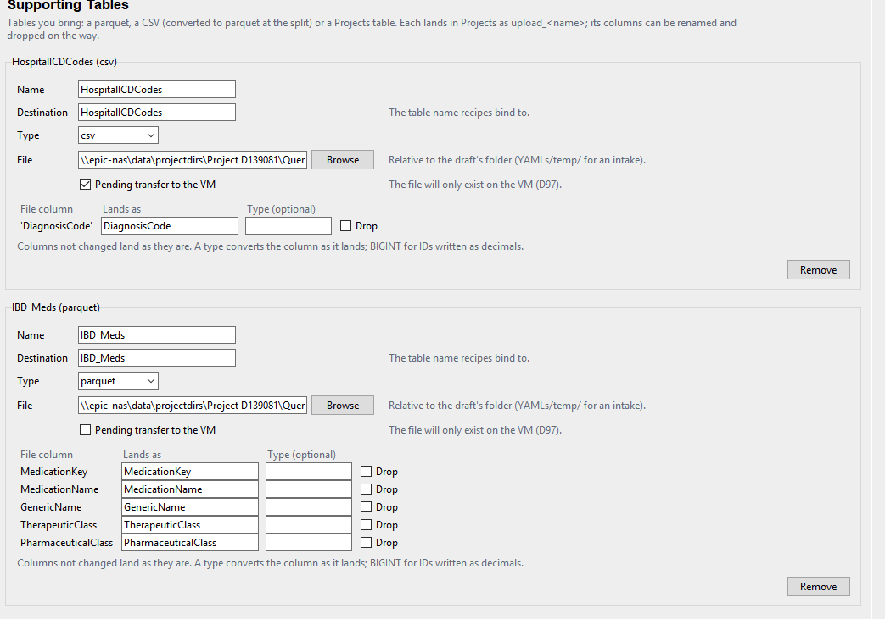
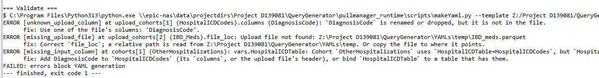

File for discussing ideas/improvements. Your notes, then Claude's reply in a box with a blue border, and yours in one with an orange border; type anywhere inside the orange box, between its `:::` lines (D174). New notes go above **Settled**; what is agreed moves there, then into the plan documents. Pasted images land in `images/` beside this file; `python3 scope.py images` deletes one once nothing mentions it (D132).

# Tasks

Nothing open here. What is left of the show-stopper tests (step 4 after each real pull, then the clean-up), the HaT PheWAS pull and the Infant_RSV re-pull are in the roadmap's **Next: On The VM, The Bundle `b822ab77…`**.

# Questions

## Batching seems to be doing cXof6 for each table instead of per table


I think the batching is doing all the c1of6, c2of6, etc. instead of going through each table. I'd rather go through each table because if there's a failure, it's much more likely that the system will have completed one if it goes by table.

::: {style="border:2px solid #4a90e2; border-radius:6px; padding:8px 12px; margin:8px 0;"}
**🟦 Claude: per table is already possible, through table groups; and the chunks themselves are the bigger cost**

**What the code does today.** A run's loop is chunk first, then every table (`session.py`, `_run_run`): refill the PK temp with chunk 1, build and land each table, then chunk 2. The **run** is what the manifest marks done or failed. A failed chunk fails the whole run, and Retry failed redoes the run from the start (its rows are cleared by `_batch` label first). So turning the loop around on its own would save nothing: a failure in Labs would still pull Encounters and Diagnoses again on the retry. To keep finished tables, each table has to be its own run.

**That already exists: table groups** (D134). Each group is its own run, with its own connections, and Retry failed pulls only the failed group. One table per group gives you exactly what you describe: every chunk of Encounters, then every chunk of Diagnoses, and so on, each finished table kept. The cost of a group is a new connection and a refill of the PK temp, which takes seconds. Tables that read each other must share a group, and validation already says so (`table_reads_another_group`). Once D177 is built, each group is also packaged and emptied as it finishes.

**The bigger finding, from your screenshot:** each chunk costs almost a whole table's query. Labs takes 22 to 23 minutes per chunk for about 2,000 rows; Diagnoses about 10 minutes; Encounters about 6. So Cosmos is scanning the table's date range on every pass, not seeking by patient. Six chunks cost about six times one pass: roughly 4.5 hours for this session, against about 45 minutes unchunked. That answers the roadmap's open question **What a batch costs**: fact tables are scanned per pass. HaT has about 6,000 patients, so it needs no chunks at all. Chunks are worth it only to keep a table within the Projects database's room, not for speed.

**Recommendation.**

1.  For HaT and its ctrl\_ pull: no `chunk` (or one at least as large as the PK). It's a blueprint edit, no code.
2.  For per-table safety: one table per group. You can do that by hand in Author today. If you want it as a default, a small addition: **Each table its own group**, a button in Table Groups that puts every ungrouped table in a group of its own name.
3.  Don't turn the loop around inside a run: without per-table completion in the manifest it saves nothing, and with it, it rebuilds what groups already do.
4.  The roadmap's "What a batch costs" becomes a finding in `design.md`: prefer few, large chunks.

**For you to decide:** whether to add **Each table its own group** (2), or just use groups by hand.
:::

::: {style="border:2px solid #e2904a; border-radius:6px; padding:8px 12px; margin:8px 0;"}
**🟧 Your response: shit - I guess we do need to have a per-table group, then. In that case the table groups are just usable as a shorthand for the user to add a bunch of groups, which is OK.**

**\
bigger question is, how many chunks should I be doing? I mean, is there any value to chunks at all? if I split into two chunks am I always taking twice the length? Is there any way I can have it actually split up the time instead?**
:::

::: {style="border:2px solid #4a90e2; border-radius:6px; padding:8px 12px; margin:8px 0;"}
**🟦 Claude: every table its own group; chunks by patient multiply the time, chunks by date would divide it**

**Per-table groups, as I read your answer:** a table in no group runs as a group of its own, one run per table, instead of all ungrouped tables together in one run. A group you name keeps its tables together, as a shorthand for tables that must share a run. Today the tables in no group run together, as one group named `run` (D134); this changes that default. Consequences:

- Retry failed pulls only the table that failed. Once D177 is built, each table is packaged and emptied as it finishes.
- Two ungrouped tables where one reads the other are now in different groups, so validation refuses them (`table_reads_another_group`), and the fix is a named group for both. Your HaT tables read only the PK, so nothing to change there.
- A new connection and a PK refill per table: seconds each.

**How many chunks, and are they worth anything?** With chunks by patient, as today, two chunks take about twice as long, for the scan-heavy tables. Cosmos's fact tables are partitioned on their date key (`StartDateKey`, `DateKey`, `PrioritizedDateKey`...), and the HaT times show each query scanning the whole date window whatever the patients: Labs takes 23 minutes for 2,000 patients' rows, as it would for all 6,000. A chunk by patient narrows only the join, not the scan. So:

- **Time:** chunks by patient never save time; N chunks cost about N scans.
- **What they are for:** keeping each query's temp and each landing small, when a pull is so large that one pass would fill tempdb or the Projects log, or run for many hours in one transaction. Only for pulls of hundreds of thousands of patients; HaT needs none.
- **How many:** as few as fit. Start with none. Add chunks only after a pull fails for space, and then large ones (`chunk: 100000` or more).

**Splitting the time instead: chunks by date window.** Each pass reads only its own years of the partition key, so Cosmos skips the other partitions, and N windows cost about one whole scan, divided. For example, `min_date_key` to `max_date_key` cut into yearly windows, each run filling `{{min_date_key}}` and `{{max_date_key}}` with its own year. It suits tables filtered on their partition key, which is every fact table's `standard_where`. It doesn't change the PK; each window is a run of its own, so a failed year retries alone. Rows per window vary by year.

**Recommendation:** decide the per-table default now (it's small). Record "chunks by patient never save time" as a finding, which closes the roadmap's **What a batch costs**. Put **chunks by date window** on the roadmap after D177, as its own decision, since it touches the split and the renderer.

**For you to decide:** is my reading of per-table groups right? And do you want chunks by date window on the roadmap?
:::

::: {style="border:2px solid #e2904a; border-radius:6px; padding:8px 12px; margin:8px 0;"}
**🟧 Your response:** (in the chat, 2 Oct) This is fascinating. Is there a specific rule of chunking for each type? I mean, I'm not sure how to effectively chunk then.
:::

::: {style="border:2px solid #4a90e2; border-radius:6px; padding:8px 12px; margin:8px 0;"}
**🟦 Claude: a rule per purpose; the default is no splitting at all**

Each way of splitting a pull answers one question. Pick by the problem, not by habit; with none of these problems, don't split.

| Your problem | What to use | Why | Cost |
|------------------|------------------|------------------|------------------|
| **A table failing makes you re-pull the others** | One table per group (D190, now the default) | Each table is its own run; Retry failed pulls only the one that failed | Seconds per table |
| **The pull takes too long** | Chunks by **date window** (proposed, below) | Each pass scans only its own years, so the passes divide the time | One pass per window, all adding up to about one scan |
| **One pass runs out of tempdb, or its landing is too big** (an error naming `tempdb` or the log, 9002 or 1105 in tempdb) | Chunks by **patient** (`chunk:`), as few as fit, e.g. `chunk: 100000` | Each pass builds and lands a smaller temp | Every chunk scans the whole date window again: N chunks, about N times the time |
| **The project database fills** | Not chunks: D177, packaging each group and emptying it | The destination holds every row whatever the chunks | (D177) |
| **Separate files per value, or matched controls** (by sex, state) | Batching **by value** (`sex`, `state`, D58, D59) | One run and parquet per value; controls sampled per value | Every value scans the window again, as patient chunks do |

So, for each kind of pull:

- **A small cohort** (HaT, about 6,000 patients): nothing. One group per table, no chunks.
- **A large cohort, finishing in a night**: still nothing.
- **A large cohort that takes too long**: date windows, once built. Yearly windows over 2015 to 2026 is 12 runs, each about a twelfth of the time.
- **A huge cohort that fails for tempdb**: patient chunks, large, and accept the time. We have not yet seen a tempdb failure; Crohns' and UC's failures were the project database filling, which chunks do not fix.

**Chunks by date window, in short:** a splitter that cuts `min_date_key` to `max_date_key` into windows (a year, say), each a run of its own, filling the dates its tables filter on. It only helps a table filtered on its partition key, which is every fact table's `standard_where`; a table that isn't would scan everything in every window. The PK isn't split; each window joins the whole PK.

**For you to decide:** put **chunks by date window** on the roadmap after D177? It would be its own decision first: what the window is (yearly, or a number of months), and what Author shows.
:::

::: {style="border:2px solid #e2904a; border-radius:6px; padding:8px 12px; margin:8px 0;"}
**🟧 Your response:** Okay, so to play devil's advocate, why wouldn't I just do a standard chunk by date window for everything? Would it not always save the risk of failure, but also not take longer becuase the passes divide the time?
:::

::: {style="border:2px solid #4a90e2; border-radius:6px; padding:8px 12px; margin:8px 0;"}
**🟦 Claude: not for everything; it can give wrong answers silently, and whether it saves time at all is unmeasured, so test first**

**Why not a default for every table.**

1.  **It may not divide the time.** "Windows divide the time" is a prediction from the HaT timings, not a measurement. It holds only if SQL Server skips the other years when a query filters on the partition key. If the fact tables are views over something else, are partitioned coarsely, or the filter doesn't reach the partitions, a one-year window costs nearly a whole pass. Then twelve windows cost twelve passes, as patient chunks do. The test below settles this.
2.  **Wrong rows, silently, when a dedup group spans windows.** Each window dedups on its own. HaT's tables dedup on row keys (`EncounterKey`, `DiagnosisEventKey`, `LabComponentResultKey`). Each row has one date and falls in one window, so they're safe. But a dedup on `PatientDurableKey, BillingCodeValue` ordered by date ("the first time each code appears", common in a PheWAS) keeps one row per window: up to twelve "firsts" per patient and code. The PK (first D89.44) has the same problem, which is why it isn't windowed.
3.  **Lost rows, silently, across a join of two fact tables.** Suppose a table joins `DiagnosisEventFact` to `EncounterFact` with both dates windowed. A diagnosis dated 2 January on an encounter of 31 December matches in neither window.
4.  **Only a table filtered on its partition key gains.** A table filtered on another date, or not by date at all, reads everything in every window: N times the cost.
5.  **A fixed cost per window.** Each window is a run: a connection, the PK copied into Cosmos, and the dimension joins read again. HaT's 1,000-row PK copied in 0s. Crohns' 1.28 million rows took 2m 31s to upload, and copying a PK that size for every window of every table adds hours.
6.  **Windows are uneven.** Cosmos grows each year, so 2025 may hold several times as many rows as 2016. A yearly window doesn't bound tempdb or the landing; only a cap on rows does.
7.  **It doesn't lower the risk of failure. It lowers what a failure costs.** More runs means more connections and steps, so slightly more chances to fail, and each is cheaper to retry. With D190 a failed table already retries alone, so what windows add is redoing a 2-minute window of Labs instead of all 23 minutes.
8.  **The destination still holds every row.** A full project database is D177's problem, whatever the windows.

**So:** windows for a table whose pass is long, and only if the test says they work and the table (a) filters on its partition key, (b) dedups on a row key and (c) joins no other fact table. Validation could check all three and refuse the rest with an error that names the cause (D28). The default stays no splitting.

**A cheap test, in SSMS against the `COSMOS` database** (`Dual` is a template setting, not a database; the timed version given in the chat on 4 Oct runs every step in one go and returns one results grid). It uses Encounters, the cheapest table (about 6 minutes a pass in your screenshot), and HaT's patients, and takes about half an hour. Keep everything in **one query window**, since `#pk` lasts only as long as that connection. Run each query on its own (select it, F5). For each, copy from the Messages tab the `Table 'EncounterFact'…` line and the `elapsed time`.

*Step 0, seconds: what can we see?* A screenshot of the four results is enough. An empty result is an answer too; `sys.partitions` already returns nothing (D33).

``` sql
SELECT HAS_PERMS_BY_NAME(NULL, 'DATABASE', 'SHOWPLAN') AS can_see_plans;

SELECT name, type_desc FROM sys.objects
WHERE name IN ('EncounterFact', 'DiagnosisEventFact', 'LabComponentResultFact');

SELECT i.name, i.type_desc, ds.type_desc AS stored_on, ds.name AS storage_name
FROM sys.indexes AS i
JOIN sys.data_spaces AS ds ON ds.data_space_id = i.data_space_id
WHERE i.object_id = OBJECT_ID('dbo.EncounterFact');

SELECT pf.name, prv.boundary_id, prv.value
FROM sys.partition_functions AS pf
JOIN sys.partition_range_values AS prv ON prv.function_id = pf.function_id
ORDER BY pf.name, prv.boundary_id;
```

These say whether the facts are tables or views (a view hides its partitions); whether they're stored by row or as a columnstore (`CLUSTERED COLUMNSTORE`, which reads only the columns a query names); and whether they're partitioned, and how finely (the boundaries step by year, month or day).

*Step 1: 1,000 HaT patients.* This is one pass over `DiagnosisEventFact`, so a few minutes:

``` sql
SET STATISTICS IO, TIME ON;

SELECT DISTINCT TOP (1000) def.PatientDurableKey
INTO #pk
FROM DiagnosisEventFact AS def
INNER JOIN DiagnosisTerminologyDim AS dt ON dt.DiagnosisKey = def.DiagnosisKey
WHERE def._IsDeleted = 0
  AND def.StartDateKey BETWEEN 20150101 AND 20260601
  AND dt._IsDeleted = 0 AND dt.Type = 'ICD-10-CM' AND dt.Value = 'D89.44'
ORDER BY def.PatientDurableKey;
```

*Step 2: four counts, in the order A, B, C, D, then A again.*

``` sql
-- A: 1,000 patients, the whole window
SELECT COUNT_BIG(*) FROM EncounterFact AS ef
INNER JOIN #pk AS pk ON pk.PatientDurableKey = ef.PatientDurableKey
WHERE ef._IsDeleted = 0 AND ef.DateKey BETWEEN 20150101 AND 20260601;

-- B: 1,000 patients, 2025 only
SELECT COUNT_BIG(*) FROM EncounterFact AS ef
INNER JOIN #pk AS pk ON pk.PatientDurableKey = ef.PatientDurableKey
WHERE ef._IsDeleted = 0 AND ef.DateKey BETWEEN 20250101 AND 20251231;

-- C: 10 patients, the whole window
SELECT COUNT_BIG(*) FROM EncounterFact AS ef
WHERE ef._IsDeleted = 0 AND ef.DateKey BETWEEN 20150101 AND 20260601
  AND ef.PatientDurableKey IN (SELECT TOP (10) PatientDurableKey FROM #pk ORDER BY PatientDurableKey);

-- D: no patients, the whole window
SELECT COUNT_BIG(*) FROM EncounterFact AS ef
WHERE ef._IsDeleted = 0 AND ef.DateKey BETWEEN 20150101 AND 20260601;
```

What each explanation predicts:

| Query | If each pass reads the whole window | If it finds rows by patient |
|-------------------|---------------------------|---------------------------|
| A: 1,000 patients, 2015–2026 | the baseline | the baseline |
| B: 1,000 patients, 2025 only | about a tenth of A: **windows work** | about A, or a little less |
| C: 10 patients, 2015–2026 | about A: **patients don't narrow the read** | far less than A |
| D: no patients, 2015–2026 | about A | more than A |
| A again | about A | about A |

How to read the edge cases:

- **A again much faster than A:** the first run read from disk and the second from memory, so repeat each query and keep its second time.
- **A far under 6 minutes:** the count names fewer columns than the real pull. That points to a columnstore, which step 0 should confirm, and is worth knowing in itself, since a pull's time would then grow with its columns.
- **SHOWPLAN allowed:** run B once more with Include Actual Execution Plan (Ctrl+M) and screenshot the `EncounterFact` operator's tooltip. It shows Seek or Scan, and the partitions it actually read.

*Step 3, only if B is about a tenth of A: the real cost of a Labs window.* Labs takes 23 minutes a pass. `SELECT *` reads every column, more than the pull does, so treat its time as an upper bound:

``` sql
SELECT lcrf.* INTO #labs
FROM LabComponentResultFact AS lcrf
INNER JOIN #pk AS pk ON pk.PatientDurableKey = lcrf.PatientDurableKey
WHERE lcrf._IsDeleted = 0
  AND lcrf.PrioritizedDateKey BETWEEN 20250101 AND 20251231
  AND lcrf.LabComponentKey IN (2287, 8166, 16740, 51583, 59082, 75051, 86072, 91367);
```

**What each outcome decides.**

- **B a tenth of A, C about A:** the explanation holds. Chunks by date window go on the roadmap, limited by the three checks above.
- **B about A:** windows don't help, so drop the idea. The only lever left is fewer passes: no chunks, and fewer columns if it's a columnstore.
- **C far less than A:** Cosmos does find rows by patient. Patient chunks then don't cost N times, and HaT's slowness has another cause (Labs' `LabComponentKey` filter is the first suspect), so we'd profile that next.

**For you to decide:** run it? If step 0 shows views, or nothing, still run step 2. The timings answer the question without the metadata.
:::

::: {style="border:2px solid #e2904a; border-radius:6px; padding:8px 12px; margin:8px 0;"}
**🟧 Your response:** (in the chat, 4 Oct)

- **Wrong rows across windows (2, 3).** Accurate data is the MOST important thing here. If a function has a chance of introducing error I need to know, and we probably shouldn't use it.
- **Only partition-filtered tables gain (4).** If we're doing smart chunking, and also one run per table, the tables where it wouldn't be of value can just NOT do chunking.
- **A fixed cost per window (5).** Less of an issue: the large PK doesn't seem to take long to upload. This 1.6 million row PK took 5 seconds (image below). If uploading were an issue, we could split the PK into smaller temporary parquets and run on those. I don't think it is.
- **Uneven windows (6).** Not really a problem; we could even go backwards in time.
- **Cheaper to redo, not less likely (7).** That's fine. What I'm trying to avoid is 1) hitting the max space (which is why we delete the tables after packaging them to parquets) and 2) unnecessarily doubling the time.
- **If the Projects table is the limit:** maybe make smaller parquets of each chunk, then join them in Python, instead of inserting every chunk into the same single Projects table.


:::

::: {style="border:2px solid #4a90e2; border-radius:6px; padding:8px 12px; margin:8px 0;"}
**🟦 Claude: accuracy first favours patient chunks, packaged chunk by chunk; your UC screenshot supports the test**

**Accuracy decides between the two kinds of splitting.** A patient chunk never splits a patient: each patient's whole history is in one chunk. A date window splits every patient's history. So:

- **Patient chunks give the same rows as no chunks** whenever each row belongs to one patient, which holds for every Cosmos fact table joined to the PK by `PatientDurableKey`. A dedup on `PatientDurableKey, BillingCodeValue` or on `EncounterKey` stays inside one chunk. IndexDiagnosis reading OtherDiagnoses works too, because both are filled for the same patients in the same chunk.
- **Date windows give the same rows only when validation correctly recognises every risky table** (2 and 3 in my last reply). That's a weaker guarantee: a mistake in the check means wrong data and no error. By your rule, date windows stay off the table unless the test shows a saving too large to ignore. Even then, only for tables with a row-key dedup and no join to another fact table, and refused loudly otherwise.

**Your idea, parquets per chunk, is the right fix for space.** It is D177 made finer: package each **chunk** as it lands, then empty the table, instead of packaging each group at the end. The Projects database then needs room for one chunk of one table, not the whole pull. "Join in Python" is really stacking: each chunk's file has the same columns and different patients. That's exact, and pyarrow can stream the files into one parquet, or Artifacts can leave them as one folder that arrow (Python and R) reads as a single table. Points to settle when it's built:

- Each chunk's rows must be checked against what the run recorded before the table is emptied, as D177 already does per group.
- A table that another table in its group reads, like OtherDiagnoses for IndexDiagnosis, can only be emptied once every table of that chunk has landed.
- The run scan must expect the empty tables.

**On the 5 seconds: a correction, but your conclusion holds.** The `pk` phase's 5s is the Projects copy made from the upload, inside Projects. Carrying the file to Projects and Cosmos is `upload_cohorts`: 1m 34s for 1.69 million rows. Each run copies its PK slice from Projects through Python into Cosmos (`session.py`, `bulk_insert`). With patient chunks the slices add up to one PK per table, so splitting the PK further saves nothing. With date windows, every window copies the whole PK, about a minute here: 12 windows × UC's 8 tables ≈ 1½ hours. That's real, but small next to the passes themselves.

**Not chunking where it doesn't help:** yes. Today the chunk setting belongs to the whole template; every table's session uses it. With D190 each table is its own group, so the natural home is a chunk size per group. That would be a new decision, and it's the base the **Guessing/smart chunking** exploration would build on.

**Your UC screenshot is evidence for the time question.** Non-Surgical-Visits ran 1.69 million patients in 50,000-patient chunks: 34 chunks, 3 tables, 4h 30m, so about 8 minutes a chunk.

- **The tables have no date window at all.** EDVisitHistory and HospitalAdmissions have none, so date windows could never help them.
- **One table joins two fact tables.** OtherHospitalizations joins `HospitalAdmissionFact` to `DiagnosisEventFact`, the case windows get wrong.
- **One pass may be all it needs.** If each chunk reads its whole tables, as HaT suggests, the same group in one pass would be about 8 minutes, not 4½ hours. The space was the reason for the chunks.

The test settles it. If it confirms that each pass reads the whole window, then the plan is:

- **Packaging chunk by chunk** for space.
- **As few chunks as fit**, chosen per group.
- **No date windows.**

That gets both of your goals, room and no unnecessary time, without any accuracy risk.

**A question:** the Diagnoses group shows 2m 8s. Was that the retry after the hand rescue, with OtherDiagnoses already saved? If it pulled for real, 2 minutes for 1.69 million patients would contradict the HaT timings, and I'd want to know.

**For you to decide:** nothing yet: run the test first. After it, whether packaging chunk by chunk replaces D177's packaging by group, and whether chunks are set per group.
:::

::: {style="border:2px solid #e2904a; border-radius:6px; padding:8px 12px; margin:8px 0;"}
**🟧 Your response:** (in the chat, 4 Oct) I think Diagnoses did not? It's a little hard to tell. If the viewer says there's nothing in the diagnoses, it would make sense that there's nothing, though that might be because I pulled the artifacts earlier. I think we can assume it did not, based on these images.



:::

::: {style="border:2px solid #4a90e2; border-radius:6px; padding:8px 12px; margin:8px 0;"}
**🟦 Claude: Diagnoses pulled nothing, and that gives us a measurement; the database is full of Visits and Meds rows**

**Diagnoses did not pull, and the manifest proves it, whatever the viewer shows.** `table_rows: {}` means no table landed in any of its 34 chunks. The likeliest reason is that the hand rescue left OtherDiagnoses and IndexDiagnosis out of the retry on the VM's blueprint (the Mac's copy still has them in). The run still went through its chunks: 34 in 128 seconds, about 4 seconds each. So the HaT timings stand uncontradicted.

**That's a clean measurement of the PK refill.** With no tables, each chunk only copied its 50,000 PK rows from Projects into Cosmos: about 4 seconds per 50,000 rows, so about 2 minutes for the whole 1.69 million. I estimated about a minute before. At 2 minutes, date windows on UC would cost 12 windows × 8 tables × 2 minutes ≈ 3 hours of copying alone. Patient chunks still copy only one PK per table in total.

**The database is full of real rows.** A correction (4 Oct): I first read 17 GB as held by no table. Wrong. The window's total (19 tables, 19,988 MB) is the sum of its own table rows, and the list sorts largest first, so the screenshot was scrolled down: the three largest tables are above HospitalAdmissions, out of view. By elimination they are `ucvis_EDVisitHistory`, `ucvis_MedAdminHistory` and `ucvis_upload_IBD_Meds`, holding about 17 GB between them. So Non-Surgical-Visits and part of Meds filled the 20 GB, which is exactly the space problem D177 and packaging chunk by chunk are for. To confirm: scroll the list **up** in clear_projects_db and send the top rows, and the session's error line (Meds probably failed for space).

The log's open transaction is a smaller matter: the log is 5,719 of 12,100 MB, not full. **Open transactions** in the same window names it, if you want to end it.

**For you to decide:** nothing; it's a check.
:::

::: {style="border:2px solid #e2904a; border-radius:6px; padding:8px 12px; margin:8px 0;"}
**🟧 Your response:** (in the chat, 4 Oct) After clearing:


:::

::: {style="border:2px solid #4a90e2; border-radius:6px; padding:8px 12px; margin:8px 0;"}
**🟦 Claude: one table alone can outgrow the room, so packaging per group is not enough**

**What the two screenshots show together.**

- **One table holds 9 GB.** `ucvis_MedAdminHistory` is 9,051 MB for 51,187,764 rows, about **185 bytes a row**.
- **Another table held the rest.** Before clearing, the tables came to 19,988 MB. Take away the 2,613 MB that showed and MedAdminHistory's 9,051, and about 8.3 GB is left: almost certainly `ucvis_EDVisitHistory`, the only large table missing from both screenshots.

**What it means for the design.**

- **D177 alone doesn't fix this.** It packages and empties a *group* once the group finishes. Here a single table (MedAdminHistory, and its Meds group is unfinished) can approach the whole 20 GB on its own. Packaging per group still needs the room for the whole group at once.
- **Packaging chunk by chunk does fix it.** The database then only ever holds one chunk of one table. In 50,000-patient chunks, MedAdminHistory comes to about 1.5 million rows and 280 MB a chunk (51 million ÷ 34).
- **It's also the start of the Guessing/smart chunking exploration.** A table's bytes per row (185 here) times the rows a count expects gives its size before pulling. From that, the fewest chunks that fit can be chosen. Each table's figure can be read from Projects after any pull (`MB ÷ rows` in this window), so we can build a list.

**Check before the retry:** were Non-Surgical-Visits' tables (HospitalAdmissions, OtherHospitalizations, EDVisitHistory and their `_sp`) saved to parquet before they were dropped? If not, the retry pulls them again: about 4½ hours. The PK copy (`ucvis_upload_UCPatientInfo`) is gone too, so the retry uploads it again (about 1½ minutes).

**For you to decide:** nothing yet. This adds to the case for packaging chunk by chunk, decided after the SSMS test.
:::

::: {style="border:2px solid #e2904a; border-radius:6px; padding:8px 12px; margin:8px 0;"}
**🟧 Your response:** (in the chat, 4 Oct) The Visits tables were saved by Artifacts before I dropped them; redoing the uploaded patient list is fine. The Meds run's manifest entry: it looks like chunk 3. At chunk 3 we hit the 20 GB max???


:::

::: {style="border:2px solid #4a90e2; border-radius:6px; padding:8px 12px; margin:8px 0;"}
**🟦 Claude: two chunks of MedAdminHistory filled the database; the whole table would be about 150 GB, and the IBD meds list is uploaded but nothing reads it**

**Yes, chunk 3, and the numbers add up.**

- **It failed landing chunk 3.** The run failed in `c3of34` (patients 100,000 to 150,000) with 1105, the PRIMARY filegroup full.
- **Chunks 1 and 2 landed MedAdminHistory's 51,187,764 rows,** about 25.6 million rows and 4.5 GB per 50,000 patients (about 510 administrations a patient). Chunk 3's landing was rolled back.
- **Meds started with only about 9 GB free.** The Visits group (EDVisitHistory about 8.3 GB, HospitalAdmissions 1.3 GB, the rest) and the PK copy were still in the database, so two chunks filled it.

**Scaled to all 34 chunks, MedAdminHistory alone is about 870 million rows, about 150 GB in Projects, and about 8½ hours** (the run took 38 minutes for two chunks and part of a third, of three tables). Saved chunk by chunk it would fit through the database, 4.5 GB at a time, but it is still huge: as parquet, compressed perhaps 5 to 10 times, it is still 15 to 30 GB of files to keep on the VM and copy off.

**The cause is in the blueprint.**

- **There is no medication filter.** `MedAdminHistory`, `MedOrderHistory` and `MedDispenseHistory` each read their fact table joined to the PK with only `_IsDeleted = 0`: every medication, ever, for 1.69 million patients.
- **There is no date window either.**
- **The IBD meds list is uploaded but unused.** `IBD_Meds` (715 rows) lands in Projects, but no table in UC or Crohns joins it.

If the study needs IBD medications, joining `IBD_Meds` would cut these tables to a small fraction. That's a question about the study, not the code.

**Also unexplained:** `table_rows` lists MedAdminHistory and the three `_sp` tables, but not MedOrderHistory or MedDispenseHistory (Cosmos), and both are 0 rows in Projects. Were they turned off for this retry (`pull_this_cycle: false`), or do they return nothing?

**For the design:** this is the first case where a single table is far larger than the database, so no grouping helps. Only these do:

- **packaging chunk by chunk**, at 4.5 GB a chunk;
- **a filter**;
- **a size estimate before the pull**: bytes a row × expected rows, which Guessing/smart chunking would make. Validation would have flagged about 150 GB.

**For you to decide:** should the three Meds tables be restricted to the IBD meds list (`IBD_Meds`), and by which column? Or is the full medication history wanted?
:::

::: {style="border:2px solid #e2904a; border-radius:6px; padding:8px 12px; margin:8px 0;"}
**🟧 Your response:** (in the chat, 4 Oct) That's the whole point of `IBD_Meds`; I thought it was being used. Join on `MedicationKey`, in the intake, and for Crohns too. Then restart, with the tables already pulled turned off, so only Meds pulls.
:::

::: {style="border:2px solid #4a90e2; border-radius:6px; padding:8px 12px; margin:8px 0;"}
**🟦 Claude: the Meds filter is in; the SSMS test's Block 1 is back**

**Done (4 Oct).**

- **The filter.** All three Meds tables in `UC_VisitsMedsDiagnoses`, `Crohns_VisitsMedsDiagnoses` and `Crohns_DxHxSxRx` now carry `<alias>.MedicationKey IN (SELECT im.MedicationKey FROM {{prefix}}_IBD_Meds AS im)`. It's `IN`, not a join, so a key listed twice can't duplicate a row (D192).
- **UC's blueprint.** It has the filter, the five saved tables off, and chunks of 250,000. It went over in `yamls_to_transfer.py` (`1c208cd6…`). Its Preview on the VM: 0 errors.
- **Crohns.** Only the intakes are fixed. Their blueprints wait for each pull's state on the VM.
- **Still open:** MedOrderHistory and MedDispenseHistory (Cosmos) had 0 rows in UC's failed Meds run.

**Block 1 of the SSMS test** (on `COSMOS`):


- **No SHOWPLAN** (`can_see_plans = 0`), so query plans are out; timings are the evidence.
- **`EncounterFact`, `DiagnosisEventFact` and `LabComponentResultFact` are views,** so they have no indexes or partitions of their own; the tables under them do.
- **The big fact tables behind the views are finely partitioned:** Encounters 151 partitions, Diagnoses 150, with boundaries from `-4` to `99991231` (the sentinels). 150 is about twelve years by month, so likely **monthly**. A narrower date filter could therefore skip most of a table, *if* the view passes the filter through to its table. Block 2's row B shows whether it does.
- **The small facts (BedRequest, Bpa…) have 4 partitions:** sentinels only, effectively unpartitioned.

**For you to decide:** nothing; Block 2 is running.
:::

::: {style="border:2px solid #e2904a; border-radius:6px; padding:8px 12px; margin:8px 0;"}
\*\*🟧 Your response: Block 2\*\* 
:::

::: {style="border:2px solid #4a90e2; border-radius:6px; padding:8px 12px; margin:8px 0;"}
**🟦 Claude: patients don't narrow the read, dates do, and Cosmos reads by column**

| Count | Rows | Seconds |
|------------------------|------------------------|------------------------|
| A: 1,000 patients, 2015–2026 | 429,728 | 53.4 (51.8 again: no caching) |
| C: 10 patients, same window | 3,672 | 49.8 |
| B: 1,000 patients, 2025 only | 60,401 | 7.4 |
| D: everyone, same window, no join | 20,127,944,022 | 7.6 |

- **C ≈ A:** a hundredth of the patients costs the same. Each pass reads the whole window whatever the patients, so patient chunks cost a pass each. Confirmed, no longer inferred.
- **B ≈ A/7:** the date filter does reach the partitions through the views. Date windows *would* divide the time; D191 still rules them out for accuracy. The accurate way to the same saving is a pull's own window no wider than the study needs.
- **D: 20 billion rows in 7.6 seconds** is only possible from a **columnstore**, which reads columns, not rows. The 50 seconds of A is reading every row's `PatientDurableKey` to find the patients. It likely means a pull's time grows with the columns it selects: the count read one column in 50 s, HaT's Encounters pass (40 columns, plus building its temp) took 6 minutes. That reverses part of what I said about trimming columns: little saving in room, but possibly a real one in time. One cheap check is in the roadmap (Next: On The VM, 4 October, item 1).

**What changed:** UC's blueprint goes to 1,000,000-patient chunks (two passes instead of seven), in `yamls_to_transfer.py` `76c813d5…`. If UC isn't executing yet, extract it and Export split again.

**For you to decide:** whether to run the columns check.
:::

::: {style="border:2px solid #e2904a; border-radius:6px; padding:8px 12px; margin:8px 0;"}
**🟧 Your response:sure.**
:::

**Suggested order**

1.  **The HaT control pull** (Explorations, HatControl large splitting): it is running now, about six days at this rate, and will likely run out of room. Stop it, trim it, re-pull.
2.  **The columns check**: answered by that re-pull, whose trimmed tables show whether time falls with columns. The SSMS version in the roadmap is then only needed if it doesn't show.
3.  **Returning to SP first**: needs a screenshot of where the order looked wrong; the code and both runs say SneakPeek goes first.

Moved out on 5 October: **the Utils tab** is D194, last in the roadmap's Fixes, In Order; Block 2's results are in `design.md` (Batching, What a batch costs).

Moved out: **Make deliverables** is D189 and **one table per group** D190, both in the roadmap's order; the finding that patient chunks repeat the scan is in `design.md`; **Code Finder** is in the roadmap's future items. The profile screenshot was for your HaT repository, so it is gone from here and from `HaT Considerations.md`.

Moved out on 4 October, the thread above kept while Block 2 is out: **no date windows** is D191, **the Meds filter** D192, **SneakPeek per patient** D193; the measurements (Cosmos's views and partitions, the PK refill, bytes per row, SneakPeek against Cosmos) are in `design.md`; the UC re-pull, the Crohns state, the SSMS test's Block 2 and UC's empty Meds tables are in the roadmap's **Next: On The VM, 4 October 2026**; **Estimate size and packaging by chunk** is in its Open Problems.

# Explorations

## Guessing/smart chunking

If there is some sort of way to figure out which field is going to take the most time, and which field chunking would be less useful for. I think we could set up a dynamic chunking system. For instance, if there is six thousand rows that I need to parse, then one thousand chunks won't really be of value, and in fact, might theoretically give six times the work if I'm gonna go into a child fact table and have to filter through that table six times. It would be better for me to table once pull all the data, so long as all the data being pulled is less than the size of whatever our max transferability is going to be. I think this is not an urgent feature, and in fact might not be doable for a while, but I think right now I'm just guessing it chunks based on what I think is going to make the system faster. I think it's obvious that a one million row system is going to need to be chunked just so that the fact tables it returns is for sure gonna be under the size requirement of the 20 gigabyte you know hard drive space that I can use. But how many is that going to be? Is it you know 50,000 row chunks, 100,000 row chunks, we don't know. I think now that you've shown me you can do a preliminary analysis of how many rows and How much size in theory a query could ask. We could do this in the validate section where you can essentially estimate how much size the data is going to require, and thus anything that goes above let's say 10 gigabytes should be chunked in a way that minimizes the task of pulling, but then also doesn't stretch out the time because of multiple pulls.

This doesn't have to really be a dynamic AI analysis. I think algorithmically we could do this, assuming that there's some sort of standard size per row or something of that sort. It seems to me like an equation that could simply find the lowest mix of time and size such that everything gets chunked over appropriately.

::: {style="border:2px solid #4a90e2; border-radius:6px; padding:8px 12px; margin:8px 0;"}
**🟦 Claude: Estimate size, in three stages, each better than the last** (from the chat, 4 Oct)

**Size = rows × bytes per row.** Each half has a cheap source.

**Bytes per row.**

- **Fixed types** come straight from the dictionary, which Validate already reads: BIGINT 8, INT 4, DATETIME2 8, DATE 3, TINYINT 1. Add about 20 bytes a row for SQL Server's row header and `_batch`.
- **Text** needs an average length. Before any pull, use the declared width as a cautious upper bound.
- **Measured width.** Execute already measures each text column's widest value at staging and reports it (D34, D70: measured, never applied to the destination). Adding `AVG(DATALENGTH(col))` to the same query (`local_sql.py`) gives the average a size needs, at almost no cost.
- **Check against Projects:** UC's MedAdminHistory types give about 140 bytes a row against 185 measured. The rest is pages not filled.

**Rows: counting costs a pass** (the HaT finding), so the rows come from what a pull already learns.

1.  **Preliminary, at Validate:** the PK's size × rows per patient from earlier pulls (D157 records the median, 90th percentile and maximum per patient for every table). A table never pulled shows bytes per row only. A new filter makes an old figure an overestimate, the safe direction.
2.  **Before the Cosmos sessions, from SneakPeek:** under `Dual` every SneakPeek session runs first (D65), so its rows per patient are known before Cosmos starts, for free. *But first check that SneakPeek is representative per patient.* In UC, MedAdminHistory_sp landed 564,163 rows. Cosmos landed about 510 per patient. If SneakPeek is a 1% sample, UC's \~1.69 million patients would be \~17,000 there, so \~33 per patient, a fifteenth of Cosmos. The `_sp` session's PK rows in UC's manifest give the exact figure. If it really is that much lower, SneakPeek keeps less history per patient and can't be scaled up.
3.  **After the first chunk, from the pull itself:** chunk 1's rows and bytes × the number of chunks. If that exceeds the room left in the Projects database, stop loudly, with the numbers. UC would have stopped after chunk 1: "MedAdminHistory projects to about 150 GB; the database has 9 GB free". It wouldn't have failed at chunk 3 after 38 minutes.

**What columns are worth** (a side answer from the chat). Dropping columns saves their bytes only, not their share of the column count. The per-row overhead stays, a BIGINT is 8 bytes and a text column can be hundreds. Parquet compresses repetitive columns almost to nothing. Pull time only falls if Cosmos stores its tables by column (step 0 of the SSMS test). So trim wide text columns, not dates and keys. Filtering rows is the big lever.

**For you to decide:** nothing yet. First, the `_sp` session's PK rows in UC's manifest, to see whether SneakPeek can be scaled up.
:::

::: {style="border:2px solid #e2904a; border-radius:6px; padding:8px 12px; margin:8px 0;"}
**🟧 Your response:** (in the chat, 4 Oct) HaT's manifest instead, since it's done: the PK and run entries of `hat_Patients_sp` and `hat_Patients` (screenshots in the chat).
:::

::: {style="border:2px solid #4a90e2; border-radius:6px; padding:8px 12px; margin:8px 0;"}
**🟦 Claude: SneakPeek matches Cosmos per patient, and costs a minute; a good probe**

HaT PheWAS, 2 October:

|   | SneakPeek | Cosmos | SneakPeek's rows/patient × Cosmos PK, against actual |
|------------------|------------------|------------------|------------------|
| PK (patients) | 49 | 5,969 | (0.8%: SneakPeek is about 1%) |
| Encounters per patient: mean, median, p90 | 287, 210, 603 | 327, 205, 768 | 1.71 M against 1.95 M (−12%) |
| Diagnoses | 935, 530, 2,001 | 964, 535, 2,282 | 5.58 M against 5.76 M (−3%) |
| Labs | 2.2, 2, 5.2 | 1.8, 2, 6 | 13,200 against 10,984 (+20%) |
| Time: PK, then the three tables | 18 s, 1 m 4 s | 10 m, 3 h 54 m |  |

**What it shows.**

- **Rows per patient match.** The medians agree almost exactly (210/205, 530/535, 2/2). Scaled up, SneakPeek predicted every table to within about 20%.
- **SneakPeek misses the rare extreme patient,** as any 1% sample does: Diagnoses' maximum is 4,448 there against 42,029 in Cosmos. So the scaled estimate can run low, and a safety margin of about 25% belongs on it.
- **It is about 200 times faster:** 1 minute against 4 hours, so as a probe it's practically free. Under `Dual` it already runs first (D65).

**One caution, for an uploaded PK.** HaT's SneakPeek PK was *found in* SneakPeek: 49 patients, its own 1%. An uploaded PK (UC's 1.69 million Cosmos keys) is sent to both databases. Only the patients SneakPeek happens to hold match, so rows per patient must be divided by the patients that **matched**, the `keys` under each table's `per_key`, never by the upload's size. That explains UC's puzzle: its 564,163 MedAdminHistory_sp rows divide by however many of the 1.69 million SneakPeek holds, not by 17,000 guessed. The `per_key` → `keys` for MedAdminHistory_sp in UC's manifest would settle it.

**So the estimate's stage 2 works:** after the SneakPeek sessions, rows per matched patient × bytes per row × the Cosmos PK, plus a margin. Then stage 3 (after the first Cosmos chunk) corrects it.

**For you to decide:** nothing yet; this is evidence for the design. UC's MedAdminHistory_sp `keys` is a nice-to-have check.
:::

::: {style="border:2px solid #e2904a; border-radius:6px; padding:8px 12px; margin:8px 0;"}
**🟧 Your response:** (in the chat, 4 Oct) Yes: base it only on the patients that pulled from `_sp`. From here on most of my pulls upload the PK, so that's how the estimate stays accurate.
:::

::: {style="border:2px solid #4a90e2; border-radius:6px; padding:8px 12px; margin:8px 0;"}
**🟦 Claude: agreed; the patients to divide by are the PK's patients that SneakPeek holds, a count we don't take yet**

**A correction to my last box.** A table's `per_key` → `keys` is the patients with **at least one row in that table**, not the patients SneakPeek holds. Dividing by it overstates: HaT's Labs_sp has 108 rows over 35 `keys`, so 3.1 a patient × 5,969 = 18,400, against 10,984 actual (+68%). Dividing by all 49 PK patients gave +20%. A patient with no labs still counts as a patient.

**The rule, for when the estimate is built:** rows per patient = a table's SneakPeek rows ÷ **the PK's patients found in SneakPeek**.

- **A generated PK:** that's the SneakPeek PK's size (49 for HaT), already recorded.
- **An uploaded PK:** it is a new count, taken once per SneakPeek session as the PK goes up. It is the upload's keys present in SneakPeek's `PatientDim` (`IsCurrent = 1`), one join over the PK and seconds to run. The manifest would record it beside the PK's rows, as `patients_in_database` or similar. The estimate then scales by the Cosmos PK's size.

**To check it by hand on UC now** (optional): in SSMS on `COSMOS_SneakPeek`, upload or select UC's keys, then `SELECT COUNT(*) FROM <the keys> AS k WHERE EXISTS (SELECT 1 FROM PatientDim AS p WHERE p.DurableKey = k.PatientDurableKey AND p.IsCurrent = 1)`. Then 564,163 ÷ that count should come near Cosmos's \~510 administrations a patient.

**Where it goes:** this is one decision of the size estimate (its stage 2), recorded when the estimate is agreed and put on the roadmap.

**For you to decide:** nothing new; whether and when to put **Estimate size** on the roadmap is the exploration's own question.
:::

::: {style="border:2px solid #e2904a; border-radius:6px; padding:8px 12px; margin:8px 0;"}
**🟧 Your response:**
:::

## Dynamic ordering of table pulls depending on dependency and size

It seems like many of the roadblocks seem to be related to size of the larger tables, such as Med Dispense History, Med Admin History, Other DIagnoses, etc. I'm thinking maybe we can do ordering so that data is pulled in this order:\

- pk

- tables that other tables depend on

- small tables

- larger/sizeable tables

The idea is that we get the data that is core/needed, then the smaller ones to get them out of the way. Then we have these larger ones where chunking is actually useful, and we chunk per patient by doing a series of parquet tables for each group of say 50,000 or 100,000 patients and their data for that specific table. Then, we really can be sure that the size is not going to be an issue for the tables. It woulnd't fix the issue of having to go over the same DIagnosis fact set in Cosmos over and over again (as we can't really use the per-year option due to accuracy issues) but everythign else would be downloaded and ready. As we do chunk 1 or 2, we can then also report how long they took, and based on how many chunks, we can estimate time to finish.

## HatControl large splitting - did I doom myself to an unnecessarily long pull?  

So I ran a HaT control sample, based on the data in my phewas repo. Look at repo /code/pheauxWAS for context, especially tutorial/adapting-cosmos. The intake turned the task into 150 batches - and at this rate it could take weeks. I'm thinking this is simply unnecesssary, but I'm looking to understand if that's the case. I'm wondering if I should simply stop an dturn off the cosmos sneak-peek version to save time.




Of note, it also says that for 300k Cosmos patients it has 3 million encounters, but for 17k patients it has 1.8 million encounters! Somethign seems wrong here.

Look at the logic of this size and tell me based on what you know about approximating wait, woul dthe auto-batching plan we have address this better and save me time?

::: {style="border:2px solid #4a90e2; border-radius:6px; padding:8px 12px; margin:8px 0;"}
**🟦 Claude: stop it: about six days, and it would run out of room long before; trim the columns and use a few large chunks instead**

**Why 150.** `ctrl_PheWAS_intake.yaml` caps the pool at 300,000 patients (`stop_at_for_pk_table`) and has `chunk: 2000`, so 300,000 ÷ 2,000 = 150 passes. Every pass reads each table's whole date window again, whatever its 2,000 patients (design.md, What a batch costs).

**How long, from your log.** Each chunk takes 55 to 62 minutes:

| Table | Per chunk | Rows per chunk |
|------------------|------------------|------------------|
| ctrl_Encounters | 5 to 11 min | about 300,000 |
| ctrl_Diagnoses | 10 to 12 min | about 930,000 |
| ctrl_Labs | **31 to 45 min** | 6 to 14 |

150 chunks is **about 140 to 155 hours, roughly six days**. Two-thirds of that is Labs reading its whole window to find about ten tryptase results each time.

**The numbers aren't wrong; Status shows what has landed so far.** The Cosmos run is at `c10of150`, so its 2,967,186 encounters and 9,043,833 diagnoses are for 20,000 patients, not 300,000:

| Per patient | SneakPeek (17,884, done) | Cosmos (20,000 so far) |
|------------------|------------------|------------------|
| Encounters | 102 (median 47) | 148 |
| Diagnoses | 316 (median 125) | 452 |

**It would most likely fail for room before it finished.** Scaled to 300,000 patients, Cosmos's rate gives about 44 million encounters and 136 million diagnoses, both with every column (45 and 30). At any likely row size that is several times the project database's 20 GB, and D177 (emptying as it goes) isn't built. Roughly, a chunk adds about half a GB, so it would fill within the first day or two, after a day or more of pulling.

**The analysis reads a few columns.** `build_group_parquet.py` reads:

| Table | Pulled | Used |
|------------------|------------------|------------------|
| ctrl_Encounters | 45 | 6: PatientDurableKey, DateKey, DerivedEncounterStatus, DerivedEncounterType_X, IsEdVisit, IsHospitalAdmission |
| ctrl_Diagnoses | 30 | 5: PatientDurableKey, DiagnosisDate, DiagnosisCode, Vocabulary, DiagnosisStatus |
| ctrl_Labs | 40 | 6: PatientDurableKey, LabComponentKey, PrioritizedDateKey, NumericValue, Unit, IsBlankOrUnsuccessfulAttempt |

Each table also needs its dedup key (EncounterKey, DiagnosisEventKey, LabComponentResultKey). Cosmos reads by column (Block 2), so fewer columns should make each pass faster as well as smaller. That is the columns check you agreed to, run on a real pull.

**My recommendation.**

1.  **Stop the Cosmos session now.** Its 10 chunks are not worth keeping, because a retry redoes the run from the start anyway. The SneakPeek session is finished.
2.  **Trim the three fact tables to the columns above plus their keys.** The PK, `ctrl_Patients` (300,000 rows), stays as it is.
3.  **`chunk: 100000`: 3 passes, not 150.** With the trimmed columns, Diagnoses' 136 million rows come to roughly 10 GB in all, and about a third of that per pass, which bounds what Cosmos builds at once. Expect hours, not days: 3 passes of at most about an hour each, less if the columns help.
4.  **Re-pull everything** on the new bundle `9e742fd1` (Export split again). SneakPeek takes 13 minutes, and keeps the two databases' columns alike. With D190 each table runs alone, so a failure in one costs only that table.
5.  **Keep SneakPeek.** It finished in 13 minutes and is exactly what would have warned you (below).

**Would the auto-batching plan have caught it?** Yes, both stages:

- **The chunk note (D196, in `9e742fd1`)** would have said at Validate: "makes 150 passes of every table ... about 150 times one unchunked pass".
- **The size estimate's stage 2 (D193)** would have predicted from SneakPeek about 31 million encounters and 95 million diagnoses, far past the room at every column.
- **Packaging by chunk**, the long-term fix, would let a pull like this keep every column and still fit.

None of those three is built except the note, so today the fix is the hand edit above.

**For you to decide:** stop and re-pull as above? I can write the trimmed `ctrl_PheWAS_intake.yaml` in pheauxWAS for you to carry over, and validate it here.
:::

::: {style="border:2px solid #e2904a; border-radius:6px; padding:8px 12px; margin:8px 0;"}
**🟧 Your response:** (in the chat, 5 Oct) Stopping, and re-doing it with chunks of 100,000. The study's size can move: 5 times the cases instead of 50 if 50 takes weeks. Odd that 1.2 million patients was so much quicker; is it the department join?
:::

::: {style="border:2px solid #4a90e2; border-radius:6px; padding:8px 12px; margin:8px 0;"}
**🟦 Claude: the 1.2 million pulled one patient table and no events; the pool's size changes the room, hardly the time**

**Why 1.2 million was quick.** Crohns_PatientsFromUpload pulled one table, `PatientInfo`, from `PatientDim`: one row per patient and no events. Its 13 chunks read a dimension table 13 times, in 5m 43s altogether. The control pull reads three fact tables, every encounter, diagnosis and tryptase result from 2015 on, and each pass reads their whole date window.

**The department join isn't the cause.** `LEFT JOIN DepartmentDim` adds a few columns to each encounter, one department per encounter, so it never adds rows. The rows are all of each patient's encounters (about 148) and diagnoses (about 452). The time is the passes, Labs' above all.

**50 times or 5 times.** Block 2 showed that a pass costs nearly the same whatever its patients (10 patients 50 s, 1,000 patients 53 s). So with `chunk: 100000`:

| Pool | Passes | Time (about an hour a pass now; less with trimmed columns) | Rows: diagnoses |
|------------------|------------------|------------------|------------------|
| 300,000 (50 times) | 3 | about 3 hours | about 136 million |
| 30,000 (5 times) | 1 | about 1 hour | about 14 million |

The pool's size mostly decides the **room**, not the time. At 50 times with every column it likely won't fit in 20 GB. Trimmed to the columns the analysis reads, it likely will. 5 times fits either way, but leaves fewer controls after the eligibility rules and matching. Your plan expects 50 to give 10 per case, so 5 would give about 1.

**My suggestion:** keep 50 times and trim the columns, if you want 10 matched controls per case. Otherwise somewhere between, such as 20 times (120,000, 2 passes).

**For you to decide:** the pool's size, and whether I write the trimmed intake.
:::

::: {style="border:2px solid #e2904a; border-radius:6px; padding:8px 12px; margin:8px 0;"}
**🟧 Your response:** (in the chat, 5 Oct) I saw the SneakPeek tables in black, so I assumed they weren't done: when a whole batch is done, its tables should show green too. I like trimming, but I asked earlier whether trimming columns saves space and you said no; why is this different? Give me a copy with only the necessary columns, all those the PheWAS study needs, not just the joins. How could I choose this in future: a "barebones" blueprint of the core columns?
:::

::: {style="border:2px solid #4a90e2; border-radius:6px; padding:8px 12px; margin:8px 0;"}
**🟦 Claude: the barebones intake is written; why trimming pays here; green tables are D198**

**The copy.** It is `pheauxWAS/tutorial/adapting-cosmos/ctrl_PheWAS_barebones_intake.yaml`, beside the original, which is unchanged. It was checked against the study's plan (`reference/plan`), not only against `build_group_parquet.py`:

| Table | Columns | Kept for |
|------------------|------------------|------------------|
| ctrl_Encounters | 12 of 45 | clinic visits, ED visits and admissions (D8, D31); the observation span; `DepartmentKey`, `DepartmentSpecialty`, `DepartmentIsDeleted` and the `SiteFullyUsableInCosmos` dates, for the specialty and complete-site questions in HaT Considerations; `EncounterKey`, the dedup key |
| ctrl_Diagnoses | 7 of 30 | ICD-10-CM code and date (D15); `DiagnosisStatus` and `DiagnosisType`, for the ruled-out filter (D17); `DiagnosisEventKey` and the code, the dedup keys |
| ctrl_Patients | all 62 | 300,000 rows: small, and every covariate stays open (D10, SVI...) |
| ctrl_Labs | all 40 | a few rows a pass; D28 keeps every tryptase column, and results like "<1.0" need `Value` and the boundary columns |

It also has `chunk: 100000`. It validates exactly as the original does: one expected warning, `RandomOrder`, and the upload file is needed only on the VM. A dry run here makes one run per table. Its header says what was kept and why. A column left out (an encounter's providers, PresentOnAdmission) needs a re-pull to add later.

**Why trimming pays here, after I said it barely did.** That answer was about MedAdminHistory: 15 columns, nearly all 8-byte keys and dates. Dropping one date there saves about 8 of 185 bytes a row. Here it is different in two ways:

- **The tables are wide, and much of the width is text.** Diagnoses carries `DisplayString`, `NameAndCode`, `GroupedNameAndCode`, `ReferenceBillingCode` and `Parent`: long text on every one of about 136 million rows. Cutting 30 columns to 7, and 45 to 12, removes most of each row, not a sliver.
- **Time.** I said time would fall only if Cosmos reads by column. Block 2 has since shown that it does, so fewer columns should also mean faster passes. This pull will measure how much.

**Green tables (D198).** In Status a table row stays black while its run and session are green. A table whose run is done will be green; one still pulling or failed keeps its colour. This is in the roadmap, with the next bundle.

**For you to decide:** nothing here; the barebones question is below, under Barebones blueprints.
:::

::: {style="border:2px solid #e2904a; border-radius:6px; padding:8px 12px; margin:8px 0;"}
**🟧 Your response:**

:::

## Barebones blueprints: choosing only the columns a study needs

From the HaT control pull (above): every table takes every column (D28 there), which costs room and, now that Cosmos is known to read by column, time. A study usually knows which columns it reads.

::: {style="border:2px solid #4a90e2; border-radius:6px; padding:8px 12px; margin:8px 0;"}
**🟦 Claude: three ways to choose columns; a list the study supplies is the one that fits**

**What the code does today.** The table builder takes every column of a table's source, typed from the dictionary, and you remove columns one at a time. A recipe carries whatever columns it was saved with. Nothing knows which columns an analysis will read.

**Options.**

1.  **A list from the study (recommended).** A table gets **Keep only these columns**: paste or load a list (`PatientDurableKey, DateKey, DerivedEncounterStatus...`), and every other column is removed, its keys kept. The list can come from the analysis itself, as `build_group_parquet.py`'s `ENCOUNTER_COLS` did, so the pull and the study can't drift. Validate warns when a listed column isn't in the table, and when a dedup key would be removed.
2.  **A "core" set in the dictionary.** Each table marks its core columns (keys, dates, codes, status, type), and the builder offers Every column or Core. It needs no study, but "core" is a guess, and this study needed department and site columns that a core set would likely leave out.
3.  **Saved column sets.** A table's chosen columns saved by name ("PheWAS encounters") and reused, as recipes are. Useful once several studies share a shape.

**Recommendation.** 1, with 3 later if studies repeat. Pair it with the size estimate (roadmap), which would show what trimming saves before the pull.

**For you to decide:** whether to put **Keep only these columns** on the roadmap, and whether the list is pasted, loaded from a file, or both.
:::

::: {style="border:2px solid #e2904a; border-radius:6px; padding:8px 12px; margin:8px 0;"}
**🟧 Your response:**

:::

## Returning to SP first

\
To that end, funny enough the system isn't actually running all the sneakpeek runs first anymore. I think it's because the logic thinks i'm batching by table so do 'patients_sp' then 'patients' then 'diagnosis_sp' then diagnosis'... But no that defeats the purpose. For any future run it should always do all the SPs first for the purpose of testing then go forth and do the regulars.

::: {style="border:2px solid #4a90e2; border-radius:6px; padding:8px 12px; margin:8px 0;"}
**🟦 Claude: agreed, and the code already does it; I need to see where it didn't**

**What the code does today.**

- **The split puts every SneakPeek session first** (D65): makeYaml sorts the sessions SneakPeek first, then cases before controls.
- **Execute runs the sessions in the manifest's order.**
- **A session runs all its tables before the next starts.** Batches and table groups (D190) are inside a session, never across two.

So the order is `ctrl_Patients_sp` (PK, Encounters, Diagnoses, Labs), then `ctrl_Patients` (the same). Patients_sp, Patients, Diagnoses_sp, Diagnoses never happens.

**Your two runs agree.**

- **The control pull's Status above:** `ctrl_Patients_sp` is done (its run took 12m 58s) before `ctrl_Patients` began.
- **HaT PheWAS (2 October):** SneakPeek's whole run finished at 18:28, and the Cosmos PK started at 18:28.

**Where it might have looked otherwise:**

- **A manifest split before D65** keeps its old order, Cosmos first. D65 applies from the next split.
- **Retry failed** pulls a failed Cosmos session without re-running a SneakPeek one that is done. That is correct, but it looks like Cosmos first.
- **The Pull Log of a session on its own**, from Re-pull sessions (D158).

**For you to decide:** nothing to change unless one of those doesn't explain it. Which pull, and where did you see the order (Pull Log, Status, the console)? A screenshot of the lines would settle it.
:::

::: {style="border:2px solid #e2904a; border-radius:6px; padding:8px 12px; margin:8px 0;"}
**🟧 Your response:**

:::

## Settled

Nothing waiting.