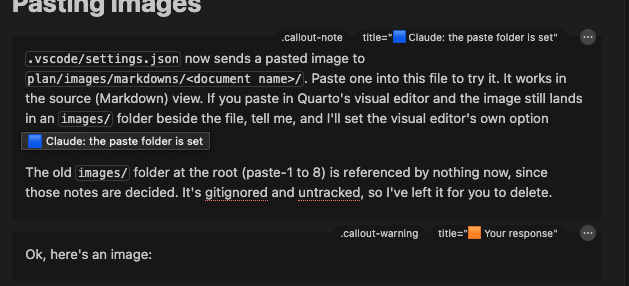

What is still under discussion (D128). Your notes, then Claude's reply in 🟦 and yours in 🟧. New notes go above **Settled**; what is agreed moves there, then into the plan documents. Pasted images land in `images/` beside this file (see Pasting images).

**Starting a new chat.** Paste this, with the section's heading filled in:

```text
Work on the task list section "<heading>" in plan/tasklist.qmd.
```

That is all a new chat needs, because the rest is already written down. It reads `.claude/CLAUDE.md` by itself, which sends it to `plan/design.md` (what exists), `plan/roadmap.md` (status and what is next) and `plan/decisions.md` (why), and tells it to answer here, topic by topic, in 🟦 and 🟧. Its memory notes load by themselves too. The one rule that keeps it true: **anything that matters and was only said in a chat goes into this file before that chat ends**, under the section it belongs to, or it is lost to the next one.

# Pasting images

::: {.callout-note title="🟦 Claude: the paste folder is set"}
`.vscode/settings.json` now sends a pasted image to `plan/images/markdowns/<document name>/`. Paste one into this file to try it. It works in the source (Markdown) view. If you paste in Quarto's visual editor and the image still lands in an `images/` folder beside the file, tell me, and I'll set the visual editor's own option instead.

The old `images/` folder at the root (paste-1 to 8) is referenced by nothing now, since those notes are decided. It's gitignored and untracked, so I've left it for you to delete.
:::

::: {.callout-warning title="🟧 Your response"}
Ok, here's an image: \
\
It seems to have saved it in the same folders' /image subfolder.\
\
Colors still aren't working. Is there no CSS that could do it? Could we have the sections designated as HTML and then do it that way? But honestly if this is where we are I'm fine with it.
:::

::: {.callout-note title="🟦 Claude: the visual editor has its own rules"}
**Images:** your paste went to `plan/images/`, the `images/` folder beside the file. That is Quarto's visual editor, which ignores the `.vscode` setting (only the source view reads it), and I know of no setting that moves its folder. **Recommendation:** accept its `images/` folder, and make the cleanup do the work. "Update docs" deletes every pasted image (`paste-*.png`) in a `plan/images/` folder that no document mentions. Deleting a document then takes its pictures with it at the next update, and your reference images are never touched. The `.vscode` setting would then be unnecessary, and I'd remove it.

**Colours:** there's no CSS the visual editor applies to callouts. It draws them as plain boxes, and raw HTML shows as code rather than being rendered. The 🟦/🟧 in the titles are as far as it goes; Quarto Preview shows the real colours.

**For you to decide:** clean up by "no document mentions it", as above?
:::

::: {.callout-warning title="🟧 Your response"}
:::

# 

# Future Breakdown of Cohort

- So I previously got all 1.2 million Crohn's PatientDurableKeys,in the recipe PatientWithDx. I now want to upload that and then get lots more info - med tables, visit tables, etc. Given the size, I thought it was going to be a huge upload, taking a long time, and that it be a major time sink in relation to doing a large poll. It turns out that it wasn't the case. It took about two minutes to do the upload of 1.2 million rows with probably ten columns. I think this changes our paradigm of trying to get the whole cohort together.

  - Previous wisdom was that if I had a multiplier I should do all the runs of one cohort together while Cosmos connection is still up. Now I see I don't have to - I could do somethign as simple as a new open connection every table if I wanted to! Of course, some tables rely on other pulle dtables, and they' often have a theme (say, the 3 medication tables), so I dont' want to group a few more than one table together. The added benefit is that I can see how it's going mid-batch, which I couldn't do either and led me to understand if soemthing was never finishing.

  - I'm now thinking we can have recipes that are multiple tables - maybe a new column called 'cohort recipes', which I could do like 'medicaitons' and have multiple tables under it. It could work like a mini cohort table, essentially, and have the same variable-based connections that everythign else does. Ideas include like medication info, visit info, birthing info, things that tend to have two or three different tables that are connected to each other in some way.

- I think this is a little more like what I had intended to do in the original set, but was afraid of the sort of cohort upload block being this huge delay. I think now we can look at it more flexibly. Say there are 9 tables, 3 in a birth block (birth fact, mother info, pregnancy fact/dim), 3 in a med block (med order, admin, dispense), visits block (edvisits, hospitaladmissions, etc.). Say I have a multiplier of, say, 'IBD' - UC, Crohns. Well if I get the PK table for all of UC, then I can move through the three blocks as their own batch, so that way we can say "getting UC Meds block" instead of "getting all UC data".

- For the UI, the question is where to place this. IN splitter, I actually think this may be a bit confusing right now, because 'separate tables' currently means meaning that the splitter duplicates the tables for a new splitter variable. Instead, that should be renamed to 'separate PKs per splitter', or something like that. Then, this table batch option could be 'group tables into a batch' and then once it's opened, you can just add different groups, give them a group name, and then it has an 'add table to group' oand 'remove table from group' and 'remove group' buttons. It should say that 'anything left over will be its own group batch' or something.

- i want to ensure the current features work first. BuTo that end, tell me your questions, so we have mutual understanding. ONce taht's done, outline the findings to 'roadmap' so we can make this the first feature add as soon as the pulls are successfully running.

::: {.callout-note title="🟦 Claude: carried over from the last chat"}
Background, not an answer: the Crohn's pull you describe above, running for hours with no news, had medication tables joined to nothing (CrohnsClinicalData), so it was reading all of MedicationOrderFact and MedicationDispenseFact in Cosmos, not your 1.2 million patients (D129, which now stops that on the Mac). Some of those hours were that, not the size of the cohort. The pulls now queued include two batching tests: Crohns_PatientsFromUpload, the uploaded PK in 100,000-row chunks; and IBD_Ancestry in 30,000-patient chunks (roadmap, The Remade Pulls). Their timings are evidence for this idea.
:::

# Settled

Nothing waiting: D117 to D128 and the roadmap's "Next: Fixes, In Order" hold everything agreed so far.